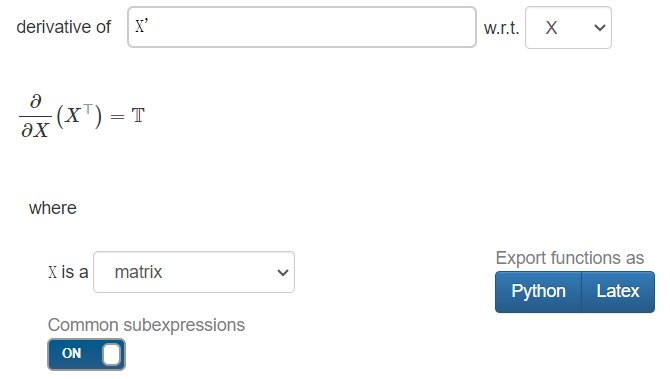
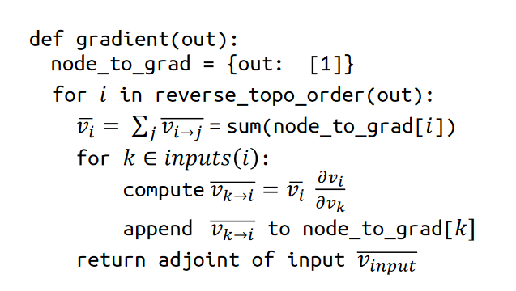
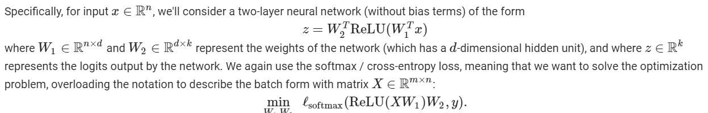

# 作业1

## 1 forward computation

题目要求在`ops_mathematic.py`实现以下功能，注意到导入的`array_api`其实是`numpy`，所以实现起来就很简单了

- `PowerScalar`: raise input to an integer (scalar) power
- `EWiseDiv`: true division of the inputs, element-wise (2 inputs)
- `DivScalar`: true division of the input by a scalar, element-wise (1 input, scalar - number)
- `MatMul`: matrix multiplication of the inputs (2 inputs)
- `Summation`: sum of array elements over given axes (1 input, axes - tuple)
- `BroadcastTo`: broadcast an array to a new shape (1 input, shape - tuple)
- `Reshape`: gives a new shape to an array without changing its data (1 input, shape - tuple)
- `Negate`: numerical negative, element-wise (1 input)
- `Transpose`: reverses the order of two axes (axis1, axis2), defaults to the last two axes (1 input, axes - tuple)

唯一值得注意的是最后一个`Transpose`的实现，它的实现涉及到`axes`参数，在`numpy`中对`axes`参数说明如下：

>axes: tuple or list of ints, optional
>If specified, it must be a tuple or list which contains a permutation of [0,1,…,N-1] where N is the number of axes of a. The i’th axis of the returned array will correspond to the axis numbered axes[i] of the input. If not specified, defaults to range(a.ndim)[::-1], which reverses the order of the axes.

简而言之，axes[i] = n 中代表结果的第i维度是原张量数组中的第n维，举例如下：

axes = [1, 0, 2]

i = 0, axes[0] = 1, 则结果的第0维是原来的第1维
i = 1, axes[1] = 0, 则结果的第1维其实是的第0维

```python
a = np.ones((1, 2, 3))
np.transpose(a, (1, 0, 2)).shape
(2, 1, 3)
```

**而正因为这些对本次实验造成了一定的困扰**，本次实验实现的`transpose`仅仅能实现两个维度的交换，但是却又要用到`numpy.tranpose()`，如前文所言两者对于`axes`参数的定义其实是不同的，因此我们需要将`axes`做一定的转化。

```python
class Transpose(TensorOp):
    def __init__(self, axes: Optional[tuple] = None):
        self.axes = axes

    def compute(self, a):
        ### BEGIN YOUR SOLUTION
        dim = list(range(len(a.shape)))
        if self.axes is None:
            dim[-2], dim[-1] = dim[-1], dim[-2]
        else:
            dim[self.axes[0]], dim[self.axes[1]] = dim[self.axes[1]], dim[self.axes[0]]
        return array_api.transpose(a, dim)
        ### END YOUR SOLUTION
```

## 2 backward passes

同样是在`ops_mathematic.py`中实现反向的梯度计算，但是这次实现的部分功能就很抽象了

### 2.1 transpose

假设`x`是一个`n * 1`的行向量，对于`y = x.T`这样的表达式，`y`关于`x`的导数是什么？换句话说，一个`n * 1`的行向量对于与一个`1 * n`的列向量求导的结果是什么？

答案是一个`n * n`的矩阵也可以是`n * 1 * 1 * n`，称为**雅可比矩阵**，在`y = x.T`的前提下是一个主对角线全为1的单位阵。

矩阵的情况则略微复杂，我们假设$X \in \mathbb{R}^{m \times n}$，则$X^T \in \mathbb{R}^{n \times m}$，则

$$
\frac{\partial X^T}{\partial X}
 = \left[\begin{array}{cccc}
\frac{\partial\left(X^T\right)}{\partial x_{1,1}} & \frac{\partial\left(X^T\right)}{\partial x_{1,2}} & \cdots & \frac{\partial\left(X^T\right)}{\partial x_{1, n}} \\
\frac{\partial\left(X^T\right)}{\partial x_{2,1}} & \frac{\partial\left(X^T\right)}{\partial x_{2,2}} & \cdots & \frac{\partial\left(X^T\right)}{\partial x_{2, n}} \\
\vdots & \vdots & \ddots & \vdots \\
\frac{\partial\left(X^T\right)}{\partial x_{m, 1}} & \frac{\partial\left(X^T\right)}{\partial x_{m, 2}} & \cdots & \frac{\partial\left(X^T\right)}{\partial x_{m, n}}
\end{array}\right]
$$

则偏导数为一个`n*m*m*n`的矩阵，并且除了`i, j, j, i`位置的元素为1，其余的元素均为0，尝试在[Matchcalculus](https://www.matrixcalculus.org/)计算，得到的结果与代码如下：



```python
"""
Sample code automatically generated on 2024-04-23 08:02:21

by www.matrixcalculus.org

from input

d/dX X' = \mathbbT

where

X is a matrix

The generated code is provided "as is" without warranty of any kind.
"""

from __future__ import division, print_function, absolute_import

import numpy as np

def fAndG(X):
    assert isinstance(X, np.ndarray)
    dim = X.shape
    assert len(dim) == 2
    X_rows = dim[0]
    X_cols = dim[1]

    functionValue = X.T
    gradient = transposeTensor(X_cols, X_rows)

    return functionValue, gradient

def transposeTensor(cols, rows):
    T = np.zeros((cols, rows, rows, cols))
    for i in range(cols):
        for j in range(rows):
            T[i, j, j, i] = 1
    return T

def checkGradient(X):
    # numerical gradient checking
    # f(x + t * delta) - f(x - t * delta) / (2t)
    # should be roughly equal to inner product <g, delta>
    t = 1E-6
    delta = np.random.randn(3, 3)
    f1, _ = fAndG(X + t * delta)
    f2, _ = fAndG(X - t * delta)
    f, g = fAndG(X)
    print('approximation error',
          np.linalg.norm((f1 - f2) / (2*t) - np.tensordot(g, delta, axes=2)))

def generateRandomData():
    X = np.random.randn(3, 3)

    return X

if __name__ == '__main__':
    X = generateRandomData()
    functionValue, gradient = fAndG(X)
    print('functionValue = ', functionValue)
    print('gradient = ', gradient)

    print('numerical gradient checking ...')
    checkGradient(X)
```

转置的后向过程花了巨大的时间来解决，百思不得其解，在此附上**暂时不能从数学角度上理解**的正确答案。

但是如果换个角度，矩阵转置怎么变回原先的矩阵？再转置。。。同理另一小问`reshape`的反向也是变形回去

```python
def gradient(self, out_grad, node):
    ### BEGIN YOUR SOLUTION
    return transpose(out_grad, self.axes)
    ### END YOUR SOLUTION
```

### 2.2 matmul

矩阵乘法的反向传播也会遇到矩阵对于矩阵求导的问题，如前文在`transpose`中所述，结果是一个四维张量（超出我的知识范围），但我们可以通过**观察维度取巧**的方法来解决。具体解释如下：

假设$A \in \mathbb{R}^{m \times n},B \in \mathbb{R}^{n \times m}$，那么如果我们无脑把他们都看成标量则有$\frac{dL}{dA} = \frac{dL}{dAB} \frac{dAB}{dA}$

首先我们知道$L$是一个实值标量函数，那么他关于某个张量求导得到的结果应该与该张量的形状相同，即有$\frac{dL}{dA} \in \mathbb{R}^{m \times n}, \frac{dL}{dAB} \in \mathbb{R}^{m \times m}$，其中$\frac{dL}{dAB}$是上一层传下来的梯度，那么为了得到一个`m*n`的张量，我们应该要有$\frac{dAB}{dA} \in \mathbb{R}^{m \times n}$，并且不难想到$\frac{dAB}{dA}$应该是关于`B`的什么形态，而$B \in \mathbb{R}^{n \times m}$，所以$\frac{dAB}{dA} = B^T$

综上所述：$\frac{dL}{dA} = \frac{dL}{dAB} B^T, \frac{dL}{dB} = A^T \frac{dL}{dAB}$

但除此之外，我们还要考虑广播在矩阵乘法运算中的影响。举例一个`6*6*5*4`的矩阵与`4*3`的矩阵相乘，这个`4*3`的矩阵会被广播成`6*6*4*3`的矩阵。在反向传播中，我们要保证求得的梯度与广播前的张量形状相同，可以使用`sum`消除维度（**这里有待商榷**）。

```python
class MatMul(TensorOp):
    def compute(self, a, b):
        ### BEGIN YOUR SOLUTION
        return a @ b
        ### END YOUR SOLUTION

    def gradient(self, out_grad, node):
        a, b = node.inputs[0], node.inputs[1]
        grad_a = out_grad @ b.transpose()
        grad_b = a.transpose() @ out_grad
        # 使用广播机制，将梯度扩展到与输入张量相同的形状
        if a.shape != grad_a.shape:
            grad_a = summation(grad_a, axes=tuple(range(len(grad_a.shape) - len(a.shape))))
        if b.shape != grad_b.shape:
            grad_b = summation(grad_b, axes=tuple(range(len(grad_b.shape) - len(b.shape))))
        return grad_a, grad_b
        ### END YOUR SOLUTION
```

### 2.3 broadcast_to

广播操作复制原有的数据到指定维度。具体来说，包括以下两种情况：

- [m, 1 ,n] --> [m, k ,n]
- [m, n] --> [k, m, n]

所以反向的思路是找到进行了发生广播的维度，在该维度上做`summation`（为什么？同一份数据经过广播变成了多份，其在前向传播中的影响变大，因此在反向传播的过程中梯度应该是这些数据的累加），代码实现如下：

```python
    def gradient(self, out_grad, node):
        ### BEGIN YOUR SOLUTION
        origin_shape = node.inputs[0].shape
        output_shape = out_grad.shape
        # 我们用axes记录发生了广播的维度，在这些维度上做summation
        axes = []
        idx = len(origin_shape) - 1
        for i in range(len(output_shape) - 1, -1, -1):
          if idx < 0:
            axes.append(i)
            continue
          if output_shape[i] != origin_shape[idx]:
            axes.append(i)
          idx -= 1
        out_grad = summation(out_grad, tuple(axes))
        return reshape(out_grad, origin_shape)
        ### END YOUR SOLUTION
```

### 2.4 summation

有了之前`broadcast_to`的经验，现在的`summation`就很好理解了。其反向过程就是先将上层传下来的梯度广播恢复到与输入向量相同的维度。

举例说明：假设`x`是一个`n * 1`的列向量，`l`是一个实值标量函数，则有
$$
\frac{\partial l}{\partial x} = \frac{\partial l}{\partial sum(x)}\ \frac{\partial sum(x)}{\partial x},\  sum(x)=\sum{x_i}
$$
注意到$\frac{\partial l}{\partial sum(x)}$是上层传下来的梯度，并且是一个标量，而$\frac{\partial sum(x)}{\partial x}$的结果是一个$[1,1...1]_n^T$的向量。所以对于向量`x`的`summation`反向传播就是将上层传下来的梯度恢复到与`x`相同的形状。

```python
    def gradient(self, out_grad, node):
        ### BEGIN YOUR SOLUTION
        # 我们需要将维度扩张到原先的维度，再在对应的维度上做广播
        # 举例来说：(3,4,5)->(3,5)，那么我们需要(3,5)->(3,1,5)->(3,4,5)
        reduce_shape = list(node.inputs[0].shape)
        grad_shape = out_grad.shape
        # 1. 首先将out_grad的维度数量恢复
        if self.axes is not None:
            if isinstance(self.axes, Number):
                self.axes = (self.axes,)
            if not isinstance(self.axes, tuple):
                self.axes = tuple(self.axes)
            for axis in self.axes:
                reduce_shape[axis] = 1
            grad = reshape(out_grad, reduce_shape)
        else:
            grad = out_grad
        return broadcast_to(grad, node.inputs[0].shape)
        ### END YOUR SOLUTION
```

## 3 topo sort

递归的拓扑排序，这部分比较简单不多赘述。

```python
def find_topo_sort(node_list: List[Value]) -> List[Value]:
    """Given a list of nodes, return a topological sort list of nodes ending in them.

    A simple algorithm is to do a post-order DFS traversal on the given nodes,
    going backwards based on input edges. Since a node is added to the ordering
    after all its predecessors are traversed due to post-order DFS, we get a topological
    sort.
    """
    ### BEGIN YOUR SOLUTION
    # visited: 一个集合，用于记录已经访问的结果
    # topo_order: 一个列表，用于保存拓扑排序的结果
    visited = set()
    topo_order = []
    # root_node = node_list[-1]
    # for node in root_node.inputs:
    #     topo_sort_dfs(node, visited, topo_order)
    # visited.add(root_node)
    # topo_order.append(root_node)
    for node in node_list:
        topo_sort_dfs(node, visited=visited, topo_order=topo_order)
    return topo_order
    ### END YOUR SOLUTION


def topo_sort_dfs(node, visited, topo_order):
    """Post-order DFS"""
    ### BEGIN YOUR SOLUTION
    if node in visited:
        return 

    if node.inputs is None:
        topo_order.append(node)
    else:
        for pre_node in node.inputs:
            topo_sort_dfs(pre_node, visited, topo_order)
        visited.add(node)
        topo_order.append(node)
    ### END YOUR SOLUTION
```

## 4 gradient_of_variables

本题是自动微分的核心算法，具体伪代码在课上的PPT也有说明：



```python
def compute_gradient_of_variables(output_tensor, out_grad):
    """Take gradient of output node with respect to each node in node_list.

    Store the computed result in the grad field of each Variable.
    """
    # a map from node to a list of gradient contributions from each output node
    node_to_output_grads_list: Dict[Tensor, List[Tensor]] = {}
    # Special note on initializing gradient of
    # We are really taking a derivative of the scalar reduce_sum(output_node)
    # instead of the vector output_node. But this is the common case for loss function.
    node_to_output_grads_list[output_tensor] = [out_grad]

    # Traverse graph in reverse topological order given the output_node that we are taking gradient wrt.
    reverse_topo_order = list(reversed(find_topo_sort([output_tensor])))

    ### BEGIN YOUR SOLUTION
    for inode in reverse_topo_order:
        v_i = sum_node_list(node_to_output_grads_list[inode])
        inode.grad = v_i

        if inode.op is None:
            continue

        v_k_i_tuple = inode.op.gradient_as_tuple(out_grad=v_i, node=inode)
        for knode, v_k_i in zip(inode.inputs, v_k_i_tuple):
            if knode not in node_to_output_grads_list:
                node_to_output_grads_list[knode] = []           
            node_to_output_grads_list[knode].append(v_k_i)

    ### END YOUR SOLUTION
```

## 5 SGD for a two-layer neural network

本题将基于我们完成的`Needle`框架（部分完成）实现一个两层神经网络的随机梯度下降算法，需要注意的是，本次使用到了`ReLu`算法，而获得`ReLu`算法的反向梯度，需要知道输入张量的具体数值，因此我们需要用到`.realize_cached_data()`。



`ReLu`的实现

```python
class ReLU(TensorOp):
    def compute(self, a):
        ### BEGIN YOUR SOLUTION
        return array_api.maximum(0, a)
        ### END YOUR SOLUTION

    def gradient(self, out_grad, node):
        ### BEGIN YOUR SOLUTION
        a = node.inputs[0].realize_cached_data()
        # a > 0的结果是一个元素类型为布尔的张量
        return out_grad * Tensor(a > 0)
        ### END YOUR SOLUTION


def relu(a):
    return ReLU()(a)
```

两层神经网络的训练

```python
def nn_epoch(X, y, W1, W2, lr=0.1, batch=100):
    """Run a single epoch of SGD for a two-layer neural network defined by the
    weights W1 and W2 (with no bias terms):
        logits = ReLU(X * W1) * W1
    The function should use the step size lr, and the specified batch size (and
    again, without randomizing the order of X).

    Args:
        X (np.ndarray[np.float32]): 2D input array of size
            (num_examples x input_dim).
        y (np.ndarray[np.uint8]): 1D class label array of size (num_examples,)
        W1 (ndl.Tensor[np.float32]): 2D array of first layer weights, of shape
            (input_dim, hidden_dim)
        W2 (ndl.Tensor[np.float32]): 2D array of second layer weights, of shape
            (hidden_dim, num_classes)
        lr (float): step size (learning rate) for SGD
        batch (int): size of SGD mini-batch

    Returns:
        Tuple: (W1, W2)
            W1: ndl.Tensor[np.float32]
            W2: ndl.Tensor[np.float32]
    """

    ### BEGIN YOUR SOLUTION
    num_examples, num_classes = X.shape[0], W2.shape[1]
    for i in range(0, num_examples, batch):
        sample = ndl.Tensor(X[i:i+batch, :])
        label = y[i:i+batch]

        Z = ndl.matmul(ndl.relu(ndl.matmul(sample, W1)), W2)
        I_y = np.zeros((batch, num_classes))
        I_y[np.arange(batch), label] = 1

        loss = softmax_loss(Z, ndl.Tensor(I_y))
        loss.backward()
        W1 = ndl.Tensor(W1.realize_cached_data() - lr * W1.grad.realize_cached_data())
        W2 = ndl.Tensor(W2.realize_cached_data() - lr * W2.grad.realize_cached_data())

    return W1, W2
    ### END YOUR SOLUTION
```

