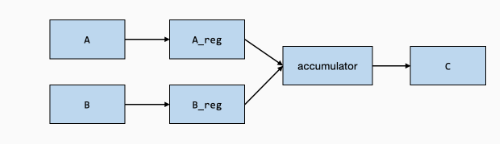

# Lesson7 GPU硬件加速2

到目前为止，我们运行的大多数 TensorIR 代码都包含一个 block，用于计算输出张量中的单个元素。现在将我们的目标转向专用硬件，许多专门的加速器在张量区域上运行计算，**TensorIR 中的 block 结构帮助我们对此类相关计算进行分组**。

## 7.1 张量化Block

```python
@tvm.script.ir_module
class MatmulBlockModule:
    @T.prim_func
    def main(
        A: T.Buffer((1024, 1024), "float32"),
        B: T.Buffer((1024, 1024), "float32"),
        C: T.Buffer((1024, 1024), "float32"),
    ) -> None:
        T.func_attr({"global_symbol": "main", "tir.noalias": True})
        for i0, j0, k0 in T.grid(64, 64, 64):
            with T.block("tmm-16x16"):
                vi0, vj0, vk0 = T.axis.remap("SSR", [i0, j0, k0])
                with T.init():
                    for i1, j1 in T.grid(16, 16):
                        with T.block("tmm_init"):
                            vi1, vj1 = T.axis.remap("SS", [i1, j1])
                            C[vi0 * 16 + vi1, vj0 * 16 + vj1] = T.float32(0)

                for i1, j1, k1 in T.grid(16, 16, 16):
                    with T.block("tmm"):
                        vi1, vj1, vk1 = T.axis.remap("SSR", [i1, j1, k1])
                        C[vi0 *16 + vi1, vj0 * 16 + vj1] += \
                            A[vi0 * 16 + vi1, vk0 * 16 + vk1] * B[vj0 * 16 + vj1, vk0 * 16 + vk1]
```

打印出这个 IRModule 的 TVMScript表示：

```python
# from tvm.script import ir as I
# from tvm.script import tir as T

@I.ir_module
class Module:
    @T.prim_func
    def main(A: T.Buffer((1024, 1024), "float32"), B: T.Buffer((1024, 1024), "float32"), C: T.Buffer((1024, 1024), "float32")):
        T.func_attr({"global_symbol": "main", "tir.noalias": True})
        # with T.block("root"):
        for i0, j0, k0 in T.grid(64, 64, 64):
            with T.block("tmm-16x16"):
                vi0, vj0, vk0 = T.axis.remap("SSR", [i0, j0, k0])
                T.reads(A[vi0 * 16:vi0 * 16 + 16, vk0 * 16:vk0 * 16 + 16], B[vj0 * 16:vj0 * 16 + 16, vk0 * 16:vk0 * 16 + 16])
                T.writes(C[vi0 * 16:vi0 * 16 + 16, vj0 * 16:vj0 * 16 + 16])
                with T.init():
                    for i1, j1 in T.grid(16, 16):
                        with T.block("tmm_init"):
                            vi1, vj1 = T.axis.remap("SS", [i1, j1])
                            T.reads()
                            T.writes(C[vi0 * 16 + vi1, vj0 * 16 + vj1])
                            C[vi0 * 16 + vi1, vj0 * 16 + vj1] = T.float32(0)
                for i1, j1, k1 in T.grid(16, 16, 16):
                    with T.block("tmm"):
                        vi1, vj1, vk1 = T.axis.remap("SSR", [i1, j1, k1])
                        T.reads(C[vi0 * 16 + vi1, vj0 * 16 + vj1], A[vi0 * 16 + vi1, vk0 * 16 + vk1], B[vj0 * 16 + vj1, vk0 * 16 + vk1])
                        T.writes(C[vi0 * 16 + vi1, vj0 * 16 + vj1])
                        C[vi0 * 16 + vi1, vj0 * 16 + vj1] = C[vi0 * 16 + vi1, vj0 * 16 + vj1] + A[vi0 * 16 + vi1, vk0 * 16 + vk1] * B[vj0 * 16 + vj1, vk0 * 16 + vk1]
```

我们注意到这个 block

```python
with T.block("tmm-16x16"):
    T.reads(A[vi0 * 16 : vi0 * 16 + 16, vk0 * 16 : vk0 * 16 + 16], B[vj0 * 16 : vj0 * 16 + 16, vk0 * 16 : vk0 * 16 + 16])
    T.writes(C[vi0 * 16 : vi0 * 16 + 16, vj0 * 16 : vj0 * 16 + 16])
    ...
```

这个 block 从 A 和 B 的区域分别读取了16\*16，并且向 C 的区域写了16\*16。在这个案例中，这个 block 的内容包含了关于**子区域计算的特定实现**，由于这个 block **包含了跨越张量子区域的计算**，我们称这样的 block 为**张量化block（tensorized block）。**

## 7.2 Blockization – 创造新的 block

TensorIR 提供了一种变换原语` blockization `来将循环的子区域组合在一起以形成张量化的计算 block。

示例如下：

```python
@tvm.script.ir_module
class MatmulModule:
    @T.prim_func
    def main(
        A: T.Buffer((1024, 1024), "float32"),
        B: T.Buffer((1024, 1024), "float32"),
        C: T.Buffer((1024, 1024), "float32"),
    ) -> None:
        T.func_attr({"global_symbol": "main", "tir.noalias": True})
        for i, j, k in T.grid(1024, 1024, 1024):
            with T.block("matmul"):
                vi, vj, vk = T.axis.remap("SSR", [i, j, k])
                with T.init():
                    C[vi, vj] = T.float32(0)
                C[vi, vj] += A[vi, vk] * B[vj, vk]
```

```python
sch = tvm.tir.Schedule(MatmulModule)
i, j, k = sch.get_loops("matmul")
i, ii = sch.split(i, factors=[None, 16])
j, ji = sch.split(j, factors=[None, 16])
k, ki = sch.split(k, factors=[None, 16])
sch.reorder(i, j, k, ii, ji, ki)
sch.mod.show()
```

输出结果如下：

```python
# from tvm.script import ir as I
# from tvm.script import tir as T

@I.ir_module
class Module:
    @T.prim_func
    def main(A: T.Buffer((1024, 1024), "float32"), B: T.Buffer((1024, 1024), "float32"), C: T.Buffer((1024, 1024), "float32")):
        T.func_attr({"global_symbol": "main", "tir.noalias": True})
        # with T.block("root"):
        for i_0, j_0, k_0, i_1, j_1, k_1 in T.grid(64, 64, 64, 16, 16, 16):
            with T.block("matmul"):
                vi = T.axis.spatial(1024, i_0 * 16 + i_1)
                vj = T.axis.spatial(1024, j_0 * 16 + j_1)
                vk = T.axis.reduce(1024, k_0 * 16 + k_1)
                T.reads(A[vi, vk], B[vj, vk])
                T.writes(C[vi, vj])
                with T.init():
                    C[vi, vj] = T.float32(0)
                C[vi, vj] = C[vi, vj] + A[vi, vk] * B[vj, vk]
```

对于这些已经分割的坐标轴，我们可以使用`blockize`原语**将多个块或以特定循环为根的子树转换为块**。

```python
# 注意到这里的ii对应于上面TVMScript代码中的i_1
block_mm = sch.blockize(ii)
sch.mod.show()
```

结果如下：

```python
# from tvm.script import ir as I
# from tvm.script import tir as T

@I.ir_module
class Module:
    @T.prim_func
    def main(A: T.Buffer((1024, 1024), "float32"), B: T.Buffer((1024, 1024), "float32"), C: T.Buffer((1024, 1024), "float32")):
        T.func_attr({"global_symbol": "main", "tir.noalias": True})
        # with T.block("root"):
        for i_0, j_0, k_0 in T.grid(64, 64, 64):
            with T.block("matmul_o"):
                vi_o, vj_o, vk_o = T.axis.remap("SSR", [i_0, j_0, k_0])
                T.reads(A[vi_o * 16:vi_o * 16 + 16, vk_o * 16:vk_o * 16 + 16], B[vj_o * 16:vj_o * 16 + 16, vk_o * 16:vk_o * 16 + 16])
                T.writes(C[vi_o * 16:vi_o * 16 + 16, vj_o * 16:vj_o * 16 + 16])
                with T.init():
                    for i_1, j_1 in T.grid(16, 16):
                        with T.block("matmul_init"):
                            vi_i_init, vj_i_init = T.axis.remap("SS", [i_1, j_1])
                            T.reads()
                            T.writes(C[vi_o * 16 + vi_i_init, vj_o * 16 + vj_i_init])
                            C[vi_o * 16 + vi_i_init, vj_o * 16 + vj_i_init] = T.float32(0)
                for i_1, j_1, k_1 in T.grid(16, 16, 16):
                    with T.block("matmul"):
                        vi_i, vj_i, vk_i = T.axis.remap("SSR", [i_1, j_1, k_1])
                        T.reads(C[vi_o * 16 + vi_i, vj_o * 16 + vj_i], A[vi_o * 16 + vi_i, vk_o * 16 + vk_i], B[vj_o * 16 + vj_i, vk_o * 16 + vk_i])
                        T.writes(C[vi_o * 16 + vi_i, vj_o * 16 + vj_i])
                        C[vi_o * 16 + vi_i, vj_o * 16 + vj_i] = C[vi_o * 16 + vi_i, vj_o * 16 + vj_i] + A[vi_o * 16 + vi_i, vk_o * 16 + vk_i] * B[vj_o * 16 + vj_i, vk_o * 16 + vk_i]
```

## 7.3 变换 TensorIR 以引入特殊内存层级

我们可以使用 `cache_read` 和 `cache_write` 来创建中间内存阶段。

这里 `global.A_reg` 包含两个部分。 `global` 表示**所有线程都可以全局访问内存**，而 `A_reg` 是内存的**层级标签**，**为后续编译映射到寄存器等特殊区域提供了机会**。

（这里讲的很抽象，因为没有具体的硬件对应说明，我的理解是申请了类似于cache的存储空间，计算单元拿数据只需要和cache交互，写回也是先写回cache再写回内存）

```python
A_reg = sch.cache_read(block_mm, 0, storage_scope="global.A_reg")
B_reg = sch.cache_read(block_mm, 1, storage_scope="global.B_reg")
sch.compute_at(A_reg, k)
sch.compute_at(B_reg, k)

write_back_block = sch.cache_write(block_mm, 0, storage_scope="global.accumulator")
sch.reverse_compute_at(write_back_block, j)
sch.mod.show()
```



变换后如下，完整详见[MLC Lesson8 引入特殊内存层级示例.md](MLC Lesson8 引入特殊内存层级示例.md)

```python
# from tvm.script import ir as I
# from tvm.script import tir as T

@I.ir_module
class Module:
    @T.prim_func
    def main(A: T.Buffer((1024, 1024), "float32"), B: T.Buffer((1024, 1024), "float32"), C: T.Buffer((1024, 1024), "float32")):
        T.func_attr({"global_symbol": "main", "tir.noalias": True})
        # with T.block("root"):
        A_global_A_reg = T.alloc_buffer((1024, 1024), scope="global.A_reg")
        B_global_B_reg = T.alloc_buffer((1024, 1024), scope="global.B_reg")
        C_global_accumulator = T.alloc_buffer((1024, 1024), scope="global.accumulator")
        # 后续省略
        ......
```

## 7.4 张量化

现在我们已经**创建了**一组映射到 TensorIR 中相应计算阶段的 **block**。 剩下的步骤是**映射一些 block 以使用映射到硬件加速指令的特定实现**。 此映射过程称为**张量化**。

我们首先注册一个**张量算子 intrinsic（TensorIntrin）**，其中**包含（1）计算和（2）实现的描述**。系统将使用描述找到与计算匹配的相关区域，而实现将计算映射到加速硬件指令。

```python
# 这一段是对算子功能的描述
@T.prim_func
def tmm16_desc(a: T.handle, b: T.handle, c: T.handle) -> None:
    A = T.match_buffer(a, (16, 16), "float32", offset_factor=16, scope="global.A_reg")
    B = T.match_buffer(b, (16, 16), "float32", offset_factor=16, scope="global.B_reg")
    C = T.match_buffer(c, (16, 16), "float32", offset_factor=16,  scope="global.accumulator")

    with T.block("root"):
        T.reads(C[0:16, 0:16], A[0:16, 0:16], B[0:16, 0:16])
        T.writes(C[0:16, 0:16])
        for i, j, k in T.grid(16, 16, 16):
            with T.block(""):
                vii, vjj, vkk = T.axis.remap("SSR", [i, j, k])
                C[vii, vjj] = C[vii, vjj] + A[vii, vkk] * B[vjj, vkk]

# 这一段是算子的实现，比如调用加速器上的特殊指令                
@T.prim_func
def tmm16_impl(a: T.handle, b: T.handle, c: T.handle) -> None:
    sa = T.int32()
    sb = T.int32()
    sc = T.int32()
    # strides可以指定内存是否连续
    A = T.match_buffer(a, (16, 16), "float32", offset_factor=16, strides=[sa, 1], scope="global.A_reg")
    B = T.match_buffer(b, (16, 16), "float32", offset_factor=16, strides=[sb, 1], scope="global.B_reg")
    C = T.match_buffer(c, (16, 16), "float32", offset_factor=16, strides=[sc, 1], scope="global.accumulator")

    with T.block("root"):
        T.reads(C[0:16, 0:16], A[0:16, 0:16], B[0:16, 0:16])
        T.writes(C[0:16, 0:16])
        T.evaluate(
            T.call_extern(
                "tmm16",
                C.access_ptr("w"),
                A.access_ptr("r"),
                B.access_ptr("r"),
                sa,
                sb,
                sc,
                dtype="int32",
            )
        )

tvm.tir.TensorIntrin.register("tmm16", tmm16_desc, tmm16_impl)
```

然后我们可以**调用 `tensorize`，将 `block_mm`（对应于 `matmul_o_update` block）映射到使用 `tmm16` 的实现。**

```
sch.decompose_reduction(block_mm, k)

sch.tensorize(block_mm, "tmm16")
```

这里我们使用 `T.call_extern` 来调用环境中的外部函数。 下游编译步骤可以轻松地将实现映射到实现操作的指令。

或者，我们可以将 `tmm16` 映射到实现这种张量化计算的微内核。 以下代码显示了如何通过外部 C 代码执行此操作（如果需要，可以进一步嵌入内联汇编）。

```python
def tmm_kernel():
    cc_code = """
      extern "C" int tmm16(float *cc, float *aa, float *bb, int stride_a, int stride_b, int stride_c) {
        for (int i = 0; i < 16; ++i) {
            for (int j = 0; j < 16; ++j) {
                for (int k = 0; k < 16; ++k) {
                    cc[i * stride_c + j] += aa[i * stride_a + k] * bb[j * stride_b + k];
                }
            }
        }
        return 0;
      }
    """
    from tvm.contrib import clang, utils

    temp = utils.tempdir()
    ll_path = temp.relpath("temp.ll")
    # Create LLVM ir from c source code
    ll_code = clang.create_llvm(cc_code, output=ll_path)
    return ll_code

sch.annotate(i, "pragma_import_llvm", tmm_kernel())
```
