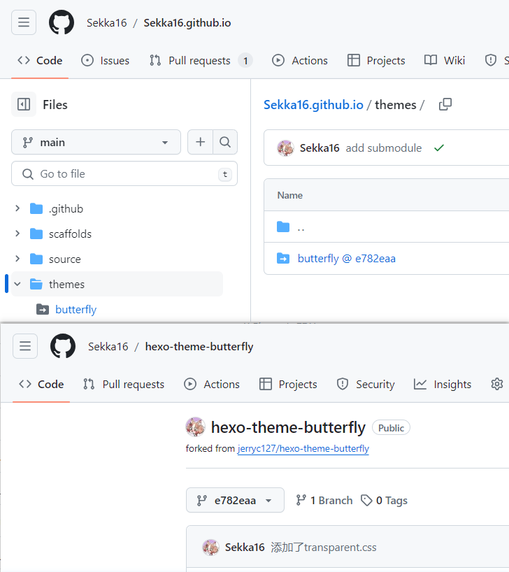

# submodule设置

## 问题背景描述

最近一直在倒腾`Butterfly`主题的配置，其中有一项是实现博客内容的透明化，详见[【博客】Butterfly魔改记录](../blog/【博客】Butterfly魔改记录.md)。在参考的教程中在`butterfly`主题的`source/css`文件夹添加了一个`transparent.css`文件（个人认为这个设置方式很抽象），之后通过在`_config.butterfly.yml`中设置完成。
```yml
inject:
  head:
    # - <link rel="stylesheet" href="/xxx.css">
    - <link rel="stylesheet" href="/css/transparent.css">
```
在本地预览时没有问题，但这里涉及到上述代码的路径问题，因为我的部署方式是通过`Git Action`的部署方式，但是我并没有将主题文件夹`themes/butterfly`上传，似乎导致了路径解析不出来。

之后误打误撞用`npm`安装主题的方式将主题文件安装在`node_modules`文件夹下然后将整个`node_modules`推送至仓库成功实现了效果，我认为问题就在于注入代码中的路径问题，我尝试将链接更换成网络链接，但是并不起作用。

后来还是放弃了`node_modules`整个上传的方式，因为GPT告诉我大家是不会上传这个东西的（是的，他仿佛在说我很业余）。接下来很自然的想法，`butterfly`的另一种安装方式是通过git安装在`themes/butterfly`文件夹下，那我把这玩意上传不就行了，这也就遇到了本文的`submodule`问题。

## 问题解决

很直接的将主题文件夹作为`submodule`加入项目仓库，**但是推送之后，远程仓库居然没有源码，而是直接链接到子模块的原仓库**，那我的修改自然也是没有了。解决方案是直接fork主题仓库，之后将我fork之后的仓库作为`submodule`加入到我的博客仓库中，这样我只需要将修改推送到fork的仓库中，这样我的魔改就能起作用。附上相关的代码即截图：

```terminal
git submodule add git@github.com:Sekka16/hexo-theme-butterfly.git themes/butterfly
```




# 附录

总结一下git submodule子模块管理的方法

添加子模块
```terminal
git submodule add <repoUrl> <directory name>
```
运行成功后子模块就添加到项目了，且会自动新增.gitmodules文件，内部记录了子模块的信息

如果子模块添加后，文件夹内没有文件，可以执行
```terminal
git submodule update --init --recursive
```

更新子模块
当子模块有更新时，在主仓库需要更新一下远程子模块代码
```terminal
git submodule update --remote
```

删除子模块
git submodule没有提供删除子模块的命令，需要自己手动删一下，并且要删除的地方有点多，不要漏了～～

第一步：删除子模块文件夹
```terminal
rm -rf 子模块目录名
```

第二步：删除.gitmodules里的子模块的信息

第三步：删除.git/modules/子模块名
```terminal
cd ./.git/modules/
rm -rf 子模块目录名
```

第四步：删除.git/config里的子模块配置信息
```terminal
vi .git/config
```
进入编辑模式，删除子模块相关信息

以上，就删除成功啦

tips:
如果以上都删除了，还是不能添加的话，就删除一下缓存吧
```terminal
git rm --cached 子模块目录名
```