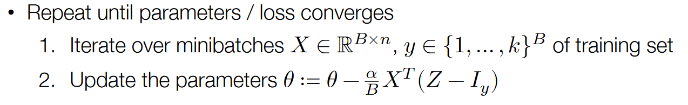

# 作业0

## 1 MINST数据集读取

```python
def parse_mnist(image_filename, label_filename):
    """ Read an images and labels file in MNIST format.  See this page:
    http://yann.lecun.com/exdb/mnist/ for a description of the file format.

    Args:
        image_filename (str): name of gzipped images file in MNIST format
        label_filename (str): name of gzipped labels file in MNIST format

    Returns:
        Tuple (X,y):
            X (numpy.ndarray[np.float32]): 2D numpy array containing the loaded 
                data.  The dimensionality of the data should be 
                (num_examples x input_dim) where 'input_dim' is the full 
                dimension of the data, e.g., since MNIST images are 28x28, it 
                will be 784.  Values should be of type np.float32, and the data 
                should be normalized to have a minimum value of 0.0 and a 
                maximum value of 1.0 (i.e., scale original values of 0 to 0.0 
                and 255 to 1.0).

            y (numpy.ndarray[dtype=np.uint8]): 1D numpy array containing the
                labels of the examples.  Values should be of type np.uint8 and
                for MNIST will contain the values 0-9.
    """
    ### BEGIN YOUR CODE
    with gzip.open(image_filename, "rb") as image, gzip.open(label_filename, "rb") as label:
        image_magic, image_number, image_rows, image_cols = struct.unpack(">IIII", image.read(16))
        image_pixels = struct.unpack("B" * (image_number * image_rows * image_cols), image.read())
        image_pixels_array = np.array(image_pixels, dtype=np.float32).reshape(image_number, image_rows * image_cols) / 255.0
        
        label_magic, label_number = struct.unpack(">II", label.read(8))
        label_values = struct.unpack("B" * label_number, label.read())
        label_values_array = np.array(label_values, dtype=np.uint8)

    return image_pixels_array, label_values_array
    ### END YOUR CODE
```

## 2 softmax_loss

为了防止将`softmax`和`softmax_loss`混在一起，以下将所有的交叉熵损失函数`softmax_loss`称为`cross_entropy`

在单个样本的前提下：
$$
z_i=p(\text { label }=i)=\frac{\exp \left(h_i(x)\right)}{\sum_{j=1}^k \exp \left(h_j(x)\right)} \Longleftrightarrow z \equiv \operatorname{softmax}(h(x))
$$

`cross_entropy`为：
$$
\ell_{c e}(h(x), y)=-\log p(\text { label }=y)=-h_y(x)+\log \sum_{j=1}^k \exp \left(h_j(x)\right)
$$
这里有一个比较让人迷惑的一点：$h_y(x)$是什么？

首先，在单个样本的前提下，$h_y(x)$是一个实值而不是一个向量。

其次，$h(x)$对应的是`softmax`的输入，$h(x)$是一个向量，故$h_y(x)$对应的其实是`softmax`的输入$h(x)$的第$y$个分量。

**注意**：以下的代码实现是在**多个样本**批处理的前提下

```python
def softmax_loss(Z, y):
    """ Return softmax loss.  Note that for the purposes of this assignment,
    you don't need to worry about "nicely" scaling the numerical properties
    of the log-sum-exp computation, but can just compute this directly.

    Args:
        Z (np.ndarray[np.float32]): 2D numpy array of shape
            (batch_size, num_classes), containing the logit predictions for
            each class.
        y (np.ndarray[np.uint8]): 1D numpy array of shape (batch_size, )
            containing the true label of each example.

    Returns:
        Average softmax loss over the sample.
    """
    ### BEGIN YOUR CODE
    batch_size = y.shape[0]
    Z_softmax = np.exp(Z) / np.sum(np.exp(Z), axis=1, keepdims=True)
    # 两种写法
    # cross_entropy = -np.log(Z_softmax[np.arange(batch_size), y]).mean()
    cross_entropy = (-Z[np.arange(batch_size), y] + np.log(np.sum(np.exp(Z), axis=1, keepdims=False))).mean()
    return cross_entropy
    ### END YOUR CODE
```

其中这一行运用了`numpy`的广播机制，具体来说，`np.exp(Z)` 中的每个元素会被分别除以 `np.sum(np.exp(Z), axis=1, keepdims=True)` 中**对应行**的值

```python
# np.exp(Z): 60000 * 10 
# np.sum(np.exp(Z), axis=1, keepdims=True): 60000 * 1
Z_softmax = np.exp(Z) / np.sum(np.exp(Z), axis=1, keepdims=True)
```

这里使用到了一个高级索引的技巧

```python
Z_softmax[np.arange(batch_size), y]
```

其中`Z_softmax`是一个二维矩阵，`np.arange(batch_size)`和`y`分别是一个一维向量，代表索引的行号和列号，由此索引得到的结果是一个一维向量。

## 3 softmax_regression_epoch

注意题目中的要求：参数中的`batch`是指`batch_size`，并且根据题目中的要求无需打乱顺序。一开始我误解了注释中的single epoch的意思，认为只需要采样一个batch（也就是100个样本），但是这显然与题目中的“无需打乱顺序“的描述相冲突，我在参阅了一些其他人的答案后发现，所有的样本都被使用了，但是每次更新参数是每个batch更新一次。此外，在我的实现中，如果最后一次样本数不够batch个，则会被丢弃，当然这里也不纠结这么多了。



```python
def softmax_regression_epoch(X, y, theta, lr = 0.1, batch=100):
    """ Run a single epoch of SGD for softmax regression on the data, using
    the step size lr and specified batch size.  This function should modify the
    theta matrix in place, and you should iterate through batches in X _without_
    randomizing the order.

    Args:
        X (np.ndarray[np.float32]): 2D input array of size
            (num_examples x input_dim).
        y (np.ndarray[np.uint8]): 1D class label array of size (num_examples,)
        theta (np.ndarrray[np.float32]): 2D array of softmax regression
            parameters, of shape (input_dim, num_classes)
        lr (float): step size (learning rate) for SGD
        batch (int): size of SGD minibatch

    Returns:
        None
    """
    ### BEGIN YOUR CODE
    num_examples, num_classes = X.shape[0], theta.shape[1]

    for i in range(0, num_examples, batch):
        # image: batch * input_dim  label: batch (* 1)
        image = X[i:i+batch, :]
        label = y[i:i+batch]

        Z = np.exp(image @ theta) / np.sum(np.exp(image @ theta), axis=1, keepdims=True)
        I_y = np.zeros((batch, num_classes))
        I_y[np.arange(batch), label] = 1

        theta -= lr * image.T @ (Z - I_y) / batch
    ### END YOUR CODE
```

