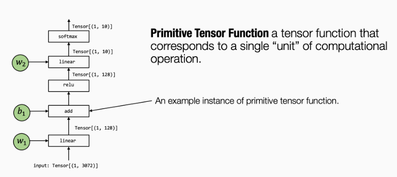
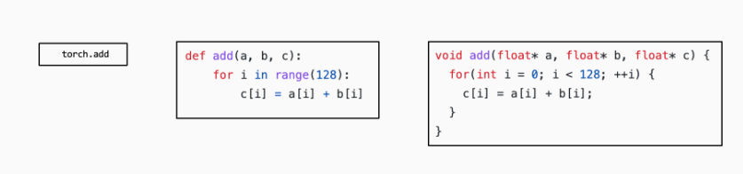
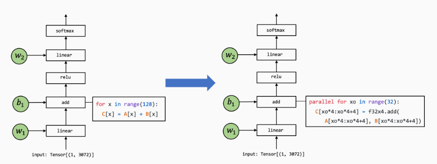
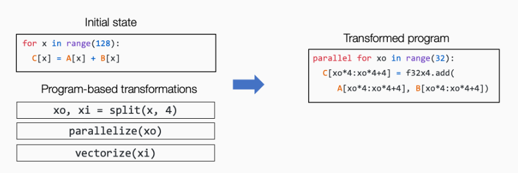
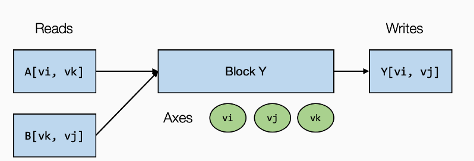

# 2 张量函数抽象

## 2.1 元张量函数

机器学习编译的过程可以被看作张量函数之间的变换。一个典型的机器学习模型的执行包含许多步将输入张量之间转化为最终预测的计算步骤，其中的每一步都被称为**元张量函数 (primitive tensor function)**。



在上面这张图中，张量算子 `linear`, `add`, `relu` 和 `softmax` 均为元张量函数。特别的是，**许多不同的抽象能够表示（和实现）同样的元张量函数**。在实践中，元张量函数有时还会包含一些汇编代码。



许多机器学习框架都提供机器学习模型的编译过程，以将元张量函数变换为**更加专门的、针对特定工作和部署环境的函数**。例如下图：



## 2.2 张量程序抽象

为了让我们能够更有效地变换元张量函数，我们**需要一个有效的抽象来表示这些函数**。

一个典型的元张量函数实现的抽象包含了以下成分：

- **存储**数据的多维数组
- 驱动张量计算的**循环**嵌套
- **计算**部分本身的语句

我们称这类抽象为**张量程序抽象**。张量程序抽象的一个重要性质是，他们能够被一系列有效的程序变换所改变。



**注意**：我们不能对任意对程序进行变换，比如一些程序循环之间存在依赖关系。

## 2.3 TensorIR：张量程序抽象

大多数的机器学习编译可以被视为张量函数之间的变换，接下来的内容主要回答以下两个问题：

- 什么是表示张量函数可能的抽象？
- 什么是张量函数之间可能的变换？

以"矩阵乘法+ReLu"为例，我们首先查看低级的numpy实现：

```python
def lnumpy_mm_relu(A: np.ndarray, B: np.ndarray, C: np.ndarray):
    Y = np.empty((128, 128), dtype="float32")
    for i in range(128):
        for j in range(128):
            for k in range(128):
                if k == 0:
                    Y[i, j] = 0
                Y[i, j] = Y[i, j] + A[i, k] * B[k, j]
    for i in range(128):
        for j in range(128):
            C[i, j] = max(Y[i, j], 0)
```

上面的示例代码展示了我们如何在**幕后**实现 `mm_relu`。当然，由于 Python 解释器，代码本身会运行得很慢。尽管如此，示例 NumPy 代码包含我们将在这些计算的实际实现中使用的所有可能元素：

- 多维缓冲区（数组）。
- 在数组维度上的循环。
- 在循环下执行的计算语句。

下面的代码块展示了 `mm_relu` 的 TensorIR 实现。这里的代码是用一种名为 TVMScript 的语言实现的，它是一种**嵌入在 Python AST 中的特定领域方言**。

```python
@tvm.script.ir_module
class MyModule:
    @T.prim_func
    def mm_relu(A: T.Buffer((128, 128), "float32"),
                B: T.Buffer((128, 128), "float32"),
                C: T.Buffer((128, 128), "float32")):
        # 这里的 global_symbol 对应函数名，tir.noalias 是一个属性，表示所有的缓冲存储器不重叠。
        T.func_attr({"global_symbol": "mm_relu", "tir.noalias": True})
        Y = T.alloc_buffer((128, 128), dtype="float32")
        for i, j, k in T.grid(128, 128, 128):
            with T.block("Y"):
                vi = T.axis.spatial(128, i)
                vj = T.axis.spatial(128, j)
                vk = T.axis.reduce(128, k)
                with T.init():
                    Y[vi, vj] = T.float32(0)
                Y[vi, vj] = Y[vi, vj] + A[vi, vk] * B[vk, vj]
        for i, j in T.grid(128, 128):
            with T.block("C"):
                vi = T.axis.spatial(128, i)
                vj = T.axis.spatial(128, j)
                C[vi, vj] = T.max(Y[vi, vj], T.float32(0))
```

我们注意到其中这三行其实确定了块轴的属性

```python
vi = T.axis.spatial(128, i)
vj = T.axis.spatial(128, j)
vk = T.axis.reduce(128, k)
```

- 定义了 `vi`、`vj`、`vk` 应被绑定到的位置（在本例中为 `i`、`j` 和 `k`）；
- 声明了 `vi`、`vj`、`vk` 的原始范围（`T.axis.spatial(128, i)` 中的 `128`）；
- 声明了块轴的属性（`spatial`, `reduce`）。



我们可以称 `vi`、`vj` 为**空间轴**，因为它们直接对应于块写入的缓冲区空间区域的开始。 涉及归约的轴（`vk`）被命名为**归约轴**。

块轴属性的声明也可以通过以下语句快速实现：

```python
# SSR means the properties of each axes are "spatial", "spatial", "reduce"
vi, vj, vk = T.axis.remap("SSR", [i, j, k])
```

## 2.4 变换

创建一个以给定的 `MyModule` 作为输入的 Schedule 辅助类。

```python
sch = tvm.tir.Schedule(MyModule)
```

执行以下操作以获得对块 `Y` 和相应循环的引用.

```python
block_Y = sch.get_block("Y", func_name="mm_relu")
i, j, k = sch.get_loops(block_Y)
```

循环分割，以及循环重排

```python
j0, j1 = sch.split(j, factors=[None, 4])
sch.reorder(j0, k, j1)
```

展示变换后的循环

```python
IPython.display.Code(sch.mod.script(), language="python")
```

将一个块移动到另一个循环的内循环中

```python
block_C = sch.get_block("C", "mm_relu")
sch.reverse_compute_at(block_C, j0)
```

将元素的初始化与规约更新分开

```python
sch.decompose_reduction(block_Y, k)
```

## 2.5 构建与运行

调用构建函数将 IRModule 变换为 `runtime.Module`，它表示可运行函数的集合。 这里 `target` 指定了部署环境的详细信息。

```python
rt_lib = tvm.build(MyModule, target="llvm")

a_nd = tvm.nd.array(a_np)
b_nd = tvm.nd.array(b_np)
c_nd = tvm.nd.empty((128, 128), dtype="float32")

rt_lib_after = tvm.build(sch.mod, target="llvm")
rt_lib_after["mm_relu"](a_nd, b_nd, c_nd)
np.testing.assert_allclose(c_mm_relu, c_nd.numpy(), rtol=1e-5)
```

## 2.6 通过张量表达式（te）生成TensorIR代码

另一种常见的获取 TensorIR 的方式是务实地生成相关代码。张量表达式 (TE) 是一种特定领域的语言，它通过 API 之类的表达式描述一系列计算。

```python
from tvm import te

A = te.placeholder((128, 128), "float32", name="A")
B = te.placeholder((128, 128), "float32", name="B")
k = te.reduce_axis((0, 128), "k")
Y = te.compute((128, 128), lambda i, j: te.sum(A[i, k] * B[k, j], axis=k), name="Y")
C = te.compute((128, 128), lambda i, j: te.max(Y[i, j], 0), name="C")
```

这里 `te.compute` 采用签名 `te.compute(output_shape, fcompute)`。 `fcompute` 函数描述了对于给定的索引 `(i, j)` 我们要如何计算元素 `Y[i, j]` 的值。

```python
lambda i, j: te.sum(A[i, k] * B[k, j], axis=k)
```

在描述计算之后，我们可以通过传递我们感兴趣的相关参数来创建一个 TensorIR 函数。在这种特殊情况下，我们想要创建一个具有两个输入参数（`A`，`B`）和一个输出参数（`C`）的函数。

```python
te_func = te.create_prim_func([A, B, C]).with_attr({"global_symbol": "mm_relu"})
MyModuleFromTE = tvm.IRModule({"mm_relu": te_func})
IPython.display.Code(MyModuleFromTE.script(), language="python")
```

张量表达式 API 作为一个有用的工具，帮助为给定的更高级别的输入生成 TensorIR 函数。
