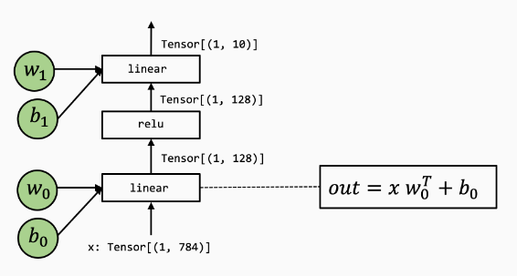
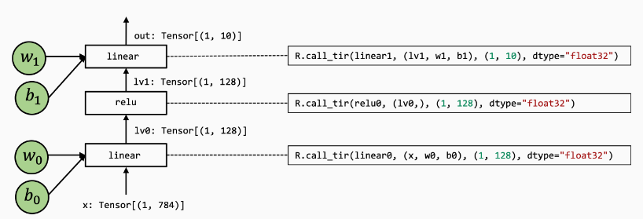

# Lesson3 端到端模型执行

## 1 端到端模型整合

示例模型：两层神经网络，包含两个全连接层和一个relu激活层



先从模型的Numpy实现开始：

```python
def numpy_mlp(data, w0, b0, w1, b1):
    lv0 = data @ w0.T + b0
    lv1 = np.maximum(lv0, 0)
    lv2 = lv1 @ w1.T + b1
    return lv2
```

上面的示例代码显示了利用高层NumPy数组操作，执行端到端模型执行的过程。

为了说明底层细节，我们将再次用底层 NumPy 编写示例：

- 我们将在使用循环而不是数组函数来演示循环计算。
- 我们总是通过 `np.empty` 显式分配数组并传递它们。（不包含数组初始化）

下面的代码展示了同一模型的底层Numpy实现：

```python
# 全连接层0
def lnumpy_linear0(X: np.ndarray, W: np.ndarray, B: np.ndarray, Z: np.ndarray):
    Y = np.empty((1, 128), dtype="float32")
    for i in range(1):
        for j in range(128):
            for k in range(784):
                if k == 0:
                    Y[i, j] = 0
                Y[i, j] = Y[i, j] + X[i, k] * W[j, k]

    for i in range(1):
        for j in range(128):
            Z[i, j] = Y[i, j] + B[j]

# relu激活层
def lnumpy_relu0(X: np.ndarray, Y: np.ndarray):
     for i in range(1):
        for j in range(128):
            Y[i, j] = np.maximum(X[i, j], 0)

# 全连接层1
def lnumpy_linear1(X: np.ndarray, W: np.ndarray, B: np.ndarray, Z: np.ndarray):
    Y = np.empty((1, 10), dtype="float32")
    for i in range(1):
        for j in range(10):
            for k in range(128):
                if k == 0:
                    Y[i, j] = 0
                Y[i, j] = Y[i, j] + X[i, k] * W[j, k]

    for i in range(1):
        for j in range(10):
            Z[i, j] = Y[i, j] + B[j]

# 整体模型
def lnumpy_mlp(data, w0, b0, w1, b1):
    lv0 = np.empty((1, 128), dtype="float32")
    lnumpy_linear0(data, w0, b0, lv0)

    lv1 = np.empty((1, 128), dtype="float32")
    lnumpy_relu0(lv0, lv1)

    out = np.empty((1, 10), dtype="float32")
    lnumpy_linear1(lv1, w1, b1, out)
    return out
```

## 2 在TVMScript中构建端到端IRModule

以低级Numpy为示例，现在准备利用MLC抽象来实现端到端模型运行，以下是TVMScript实现

```python
@tvm.script.ir_module
class MyModule:
    @T.prim_func
    def relu0(x: T.handle, y: T.handle):
        n = T.int64()
        X = T.match_buffer(x, (1, n), "float32")
        Y = T.match_buffer(y, (1, n), "float32")
        for i, j in T.grid(1, n):
            with T.block("Y"):
                vi, vj = T.axis.remap("SS", [i, j])
                Y[vi, vj] = T.max(X[vi, vj], T.float32(0))

    @T.prim_func
    def linear0(x: T.handle,
                w: T.handle,
                b: T.handle,
                z: T.handle):
        m, n, k = T.int64(), T.int64(), T.int64()
        X = T.match_buffer(x, (1, m), "float32")
        W = T.match_buffer(w, (n, m), "float32")
        B = T.match_buffer(b, (n, ), "float32")
        Z = T.match_buffer(z, (1, n), "float32")
        Y = T.alloc_buffer((1, n), "float32")
        for i, j, k in T.grid(1, n, m):
            with T.block("Y"):
                vi, vj, vk = T.axis.remap("SSR", [i, j, k])
                with T.init():
                    Y[vi, vj] = T.float32(0)
                Y[vi, vj] = Y[vi, vj] + X[vi, vk] * W[vj, vk]
        for i, j in T.grid(1, n):
            with T.block("Z"):
                vi, vj = T.axis.remap("SS", [i, j])
                Z[vi, vj] = Y[vi, vj] + B[vj]

    @R.function
    def main(x: R.Tensor((1, "m"), "float32"),
             w0: R.Tensor(("n", "m"), "float32"),
             b0: R.Tensor(("n", ), "float32"),
             w1: R.Tensor(("k", "n"), "float32"),
             b1: R.Tensor(("k", ), "float32")):
        m, n, k = T.int64(), T.int64(), T.int64()
        with R.dataflow():
            lv0 = R.call_dps_packed("linear0", (x, w0, b0), R.Tensor((1, n), "float32"))
            lv1 = R.call_dps_packed("relu0", (lv0, ), R.Tensor((1, n), "float32"))
            out = R.call_dps_packed("linear0", (lv1, w1, b1), R.Tensor((1, k), "float32"))
            R.output(out)
        return out
```

对上述程序进行如下**部分**注释：

1. `T.handle`与`T.match_buffer()`：表示数据缓冲区的抽象数据类型，表示一个数据对象但是不会指定其具体的形状、数据类型或内存位置。通过 `T.match_buffer` 函数，可以将抽象的 `T.handle` 转换为具体的 `T.Buffer` 对象。
2. `R.function`：Relax函数是一种表示上层神经网络执行的全新抽象。

## 3 在 TVMScript 中构建端到端 IRModule

### 3.1 计算图



使用图（graph）来可视化高层模型执行通常很有帮助。上图是main函数的计算图视图：

- 图中的每个框都对应于计算操作。
- 箭头对应于中间张量的输入输出。

图本身可以看作是一种抽象，在机器学习框架中通常称为**计算图 (computational graph)**

### 3.2 call_dps_packed

计算图中的每个操作步骤都包含一个`R.call_dps_packed`操作。 这是引入元张量函数的过程：

```python
lv0 = R.call_dps_packed("linear0", (x, w0, b0), R.Tensor((1, n), dtype="float32"))
```

为了解释`R.call_dps_packed`，先看一下操作等效底层Numpy实现（参考实现），如下所示：

```python
def lnumpy_call_dps_packed(prim_func, inputs, shape, dtype):
    res = np.empty(shape, dtype=dtype)
    prim_func(*inputs, res)
    return res
```

具体来说，`call_dps_packed`接受一个原函数（prim_func）的输入列表，并分配一个输出张量res，然后将输入和输出传递给prim_func。执行prim_func后，结果会填充到res中，然后返回结果。

为什么需要`call_dps_packed`这样一个函数呢？因为**元张量函数采用以下约定**：

```python
def low_level_prim_func(in0, in1, ..., out):
    # implementations
```

此约定称为：**目标传递（destination passing）**，具体来说，输入和输出**在外部显式分配**并传递给底层元函数（即代码中的`prim_func`）。这种风格通常用于底层库设计，因此高层框架可以处理内存分配决策。

**注：**并非所有张量操作都可以通过这种方式呈现（比如，有些操作的输出形状取决于输入）

这里的**关键思想是我们想要隐藏可能的分配或对函数的显式写入**。 用更正式的术语来说，我们希望函数是 **pure** 或 **side-effect free**。如果一个函数只从其输入中读取并通过其输出返回结果，它不会改变程序的其他部分（例如递增全局计数器），那么它是**pure**或**side-effect free**的。

我们可以据此将底层Numpy代码重写为：

```python
def lnumpy_mlp_with_call_dps_packed(data, w0, b0, w1, b1):
    lv0 = lnumpy_call_dps_packed(lnumpy_linear0, (data, w0, b0), (1, 128), dtype="float32")
    lv1 = lnumpy_call_dps_packed(lnumpy_relu0, (lv0, ), (1, 128), dtype="float32")
    out = lnumpy_call_dps_packed(lnumpy_linear1, (lv1, w1, b1), (1, 10), dtype="float32")
    return out
```

### 3.4 Dataflow Block

dataflow block是我们标记程序计算图区域的一种方式。 具体来说，在dataflow block中，所有操作都需要side-effect free。 在dataflow block之外，操作可能包含side-effect。示例如下：

```python
@R.function
def main(x: R.Tensor((1, "m"), "float32"),
        w0: R.Tensor(("n", "m"), "float32"),
        b0: R.Tensor(("n", ), "float32"),
        w1: R.Tensor(("k", "n"), "float32"),
        b1: R.Tensor(("k", ), "float32")):
    m, n, k = T.int64(), T.int64(), T.int64()

    with R.dataflow():
        lv0 = R.call_dps_packed("linear0", (x, w0, b0), R.Tensor((1, n), "float32"))
        gv0 = R.call_dps_packed("relu0", (lv0, ), R.Tensor((1, n), "float32"))
        R.output(gv0)

    with R.dataflow():
        out = R.call_dps_packed("linear0", (gv0, w1, b1), R.Tensor((1, k), "float32"))
        R.output(out)
    return out
```

## 4 构建并运行模型

调用 `relax.build` 来构建这个函数。 **注意：Relax 仍在开发中，因此某些 API 可能会更改。** 不过，我们的主要目标是熟悉端到端模型的整体 MLC 流程**（构造、转换、构建）**。

```python
ex = relax.build(MyModule, target="llvm")
```

build 函数会给我们一个可执行文件（译者注：“可执行文件”并非传统操作系统中的可执行文件，不能直接在系统中运行，而是针对Relax VM设计的一种文件格式）。

```python
vm = relax.VirtualMachine(ex, tvm.cpu())
```

首先构建包含输入数据和权重的 tvm NDArray，然后我们可以通过传入输入参数和权重来运行 `main` 函数。

```
data_nd = tvm.nd.array(img.reshape(1, 784))
nd_params = {k: tvm.nd.array(v) for k, v in mlp_params.items()}

nd_res = vm["main"](data_nd,
                    nd_params["w0"],
                    nd_params["b0"],
                    nd_params["w1"],
                    nd_params["b1"])
                    
print(nd_res)
```

## 5 在环境中集成现有运行库

很多情况下，我们希望将现有的库函数集成到MLC过程中

以下示例IRModule展示了如何做到这一点：

```python
@tvm.script.ir_module
class MyModuleWithExternCall:
    @R.function
    def main(x: R.Tensor((1, "m"), "float32"),
             w0: R.Tensor(("n", "m"), "float32"),
             b0: R.Tensor(("n", ), "float32"),
             w1: R.Tensor(("k", "n"), "float32"),
             b1: R.Tensor(("k", ), "float32")):
        # block 0
        m, n, k = T.int64(), T.int64(), T.int64()
        with R.dataflow():
            lv0 = R.call_dps_packed("env.linear", (x, w0, b0), R.Tensor((1, n), "float32"))
            lv1 = R.call_dps_packed("env.relu", (lv0, ), R.Tensor((1, n), "float32"))
            out = R.call_dps_packed("env.linear", (lv1, w1, b1), R.Tensor((1, k), "float32"))
            R.output(out)
        return out
```

现在我们直接在`call_dps_packed`中传入字符串

```python
R.call_dps_packed("env.linear", (x, w0, b0), R.Tensor((1, n), "float32"))
```

这些字符串是我们期望在模型执行期间的运行函数（runtime function）的名称。

### 5.1 注册运行时函数

为了能够执行调用外部函数的代码，我们需要注册相应的函数。下面的代码注册了函数的两个实现：

```python
@tvm.register_func("env.linear", override=True)
def torch_linear(x: tvm.nd.NDArray,
                 w: tvm.nd.NDArray,
                 b: tvm.nd.NDArray,
                 out: tvm.nd.NDArray):
    x_torch = torch.from_dlpack(x)
    w_torch = torch.from_dlpack(w)
    b_torch = torch.from_dlpack(b)
    out_torch = torch.from_dlpack(out)
    torch.mm(x_torch, w_torch.T, out=out_torch)
    torch.add(out_torch, b_torch, out=out_torch)

@tvm.register_func("env.relu", override=True)
def lnumpy_relu(x: tvm.nd.NDArray,
                out: tvm.nd.NDArray):
    x_torch = torch.from_dlpack(x)
    out_torch = torch.from_dlpack(out)
    torch.maximum(x_torch, torch.Tensor([0.0]), out=out_torch)
```

代码注解：

1. `from_dlpack` 将 TVM NDArray 转换为 torch NDArray。 请注意，这是一个零拷贝转换，这意味着 Torch 阵列与 TVM NDArray 共享底层内存。
2. DLPack 是一种通用的交换标准，允许不同的框架交换 Tensor/NDArray 而无需参与数据复制。 

### 5.2 构建和运行

现在我们可以构建并运行`MyModuleWithExternCall`，我们可以验证模型得到了相同的结果。

```python
ex = relax.build(MyModuleWithExternCall, target="llvm")
vm = relax.VirtualMachine(ex, tvm.cpu())

nd_res = vm["main"](data_nd,
                    nd_params["w0"],
                    nd_params["b0"],
                    nd_params["w1"],
                    nd_params["b1"])

pred_kind = np.argmax(nd_res.numpy(), axis=1)
print("MyModuleWithExternCall Prediction:", class_names[pred_kind[0]])
```

## 6 混合TensorIR Code和库

在上一个示例中，我们构建了一个IRModule，其中所有的元操作都被分派给运行库。有时将两者混合使用会有所帮助。

```python
@tvm.script.ir_module
class MyModuleMixture:
    @T.prim_func
    def linear0(x: T.handle,
                w: T.handle,
                b: T.handle,
                z: T.handle):
        m, n, k = T.int64(), T.int64(), T.int64()
        X = T.match_buffer(x, (1, m), "float32")
        W = T.match_buffer(w, (n, m), "float32")
        B = T.match_buffer(b, (n, ), "float32")
        Z = T.match_buffer(z, (1, n), "float32")
        Y = T.alloc_buffer((1, n), "float32")
        for i, j, k in T.grid(1, n, m):
            with T.block("Y"):
                vi, vj, vk = T.axis.remap("SSR", [i, j, k])
                with T.init():
                    Y[vi, vj] = T.float32(0)
                Y[vi, vj] = Y[vi, vj] + X[vi, vk] * W[vj, vk]
        for i, j in T.grid(1, n):
            with T.block("Z"):
                vi, vj = T.axis.remap("SS", [i, j])
                Z[vi, vj] = Y[vi, vj] + B[vj]

    @R.function
    def main(x: R.Tensor((1, "m"), "float32"),
             w0: R.Tensor(("n", "m"), "float32"),
             b0: R.Tensor(("n", ), "float32"),
             w1: R.Tensor(("k", "n"), "float32"),
             b1: R.Tensor(("k", ), "float32")):
        m, n, k = T.int64(), T.int64(), T.int64()
        with R.dataflow():
            lv0 = R.call_dps_packed("linear0", (x, w0, b0), R.Tensor((1, n), "float32"))
            lv1 = R.call_dps_packed("env.relu", (lv0, ), R.Tensor((1, n), "float32"))
            out = R.call_dps_packed("env.linear", (lv1, w1, b1), R.Tensor((1, k), "float32"))
            R.output(out)
        return out
```

## 7 将参数绑定到IRModule

在到目前为止的所有示例中，我们通过**显式传递参数来构造主函数**。 在许多情况下，**将参数绑定为附加到 IRModule 的常量**通常会降低API的复杂程度。 

前置代码：

```python
mlp_params = pkl.load(open("fasionmnist_mlp_params.pkl", "rb"))
nd_params = {k: tvm.nd.array(v) for k, v in mlp_params.items()}
```

以下代码通过将参数名称与 nd_params 中的键匹配来创建绑定。

```python
MyModuleWithParams = relax.transform.BindParams("main", nd_params)(MyModuleMixture)
IPython.display.Code(MyModuleWithParams.script(), language="python")
```

结果如下：

```python
# from tvm.script import ir as I
# from tvm.script import tir as T
# from tvm.script import relax as R

@I.ir_module
class Module:
    @T.prim_func
    def linear0(x: T.handle, w: T.handle, b: T.handle, z: T.handle):
        m = T.int64()
        X = T.match_buffer(x, (1, m))
        n = T.int64()
        W = T.match_buffer(w, (n, m))
        B = T.match_buffer(b, (n,))
        Z = T.match_buffer(z, (1, n))
        # with T.block("root"):
        Y = T.alloc_buffer((1, n))
        for i, j, k in T.grid(1, n, m):
            with T.block("Y"):
                vi, vj, vk = T.axis.remap("SSR", [i, j, k])
                T.reads(X[vi, vk], W[vj, vk])
                T.writes(Y[vi, vj])
                with T.init():
                    Y[vi, vj] = T.float32(0)
                Y[vi, vj] = Y[vi, vj] + X[vi, vk] * W[vj, vk]
        for i, j in T.grid(1, n):
            with T.block("Z"):
                vi, vj = T.axis.remap("SS", [i, j])
                T.reads(Y[vi, vj], B[vj])
                T.writes(Z[vi, vj])
                Z[vi, vj] = Y[vi, vj] + B[vj]

    @R.function
    def main(x: R.Tensor((1, 784), dtype="float32")) -> R.Tensor((1, 10), dtype="float32"):
        with R.dataflow():
            lv0 = R.call_dps_packed("linear0", (x, metadata["relax.expr.Constant"][0], metadata["relax.expr.Constant"][1]), out_sinfo=R.Tensor((1, 128), dtype="float32"))
            lv1 = R.call_dps_packed("env.relu", (lv0,), out_sinfo=R.Tensor((1, 128), dtype="float32"))
            out = R.call_dps_packed("env.linear", (lv1, metadata["relax.expr.Constant"][2], metadata["relax.expr.Constant"][3]), out_sinfo=R.Tensor((1, 10), dtype="float32"))
            R.output(out)
        return out
# Metadata omitted. Use show_meta=True in script() method to show it.
```

其中如果要展示Metadata，可以这样写

```python
MyModuleWithParams = relax.transform.BindParams("main", nd_params)(MyModuleMixture)
script_with_meta = MyModuleWithParams.script(show_meta=True)
print(script_with_meta)
```