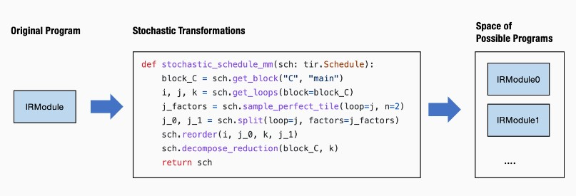

# Lesson4 自动程序优化

前文知识回顾：

- 驱动高层执行的计算图抽象
- 元张量函数的抽象
- 通过注册环境函数从而能被调用的库函数

所有的元素被分装在一个IRModule中，大多数MLC过程可以看作是元张量函数之间的变换。

## 1 随机调度变换（Stochastic Schedule Transformation）

概率式编程：给我们的变换增加一些随机元素，方法如下：

```python
def stochastic_schedule_mm(sch: tvm.tir.Schedule):
    block_C = sch.get_block("C", "main")
    i, j, k = sch.get_loops(block=block_C)
    j_factors = sch.sample_perfect_tile(loop=j, n=2)
    j_0, j_1 = sch.split(loop=j, factors=j_factors)
    sch.reorder(i, j_0, k, j_1)
    sch.decompose_reduction(block_C, k)
    return sch
```

代码解读：这里的`sch.sample_perfect_tile(loop=j, n=2)`方法表示对循环`j`进行随机采样分解成2个因子

通过`print(sch.trace)`我们可以发现多次运行`j_factors`会得到不同的值。

## 2 深入研究随机变换

在我们尝试逐步运行随机变换并且检获得的`j_factors`时，我们会发现`j_factors`不是一个实整数，而是被采样随机变量的**符号变量**。

```python
sch = tvm.tir.Schedule(MyModule)
block_C = sch.get_block("C", "main")
i, j, k = sch.get_loops(block=block_C)
j_factors = sch.sample_perfect_tile(loop=j, n=2)
type(j_factors[0])
# 输出tvm.tir.expr.Var
```

如果我们查看当前时间点的代码，我们可以发现 IRModule 保持不变，因为我们只对随机变量进行了采样，但还没有基于它们进行任何变换操作。

```python
j_0, j_1 = sch.split(loop=j, factors=j_factors)
```

在这之后IRModule才会发生变化

## 3 随机变换搜索

事实上，`stochastic_schedule_mm`创建了一个可能程序的搜索空间。



所以它指定的是一组程序，那么问题是什么是**最佳选择**呢？

为此我们需要一个搜索算法，例如：连续运行很多次，取运行时间最短的那一次作为最佳选择。当然这是最直接简单的想法。在实践中，TVM 的 `Meta-Schedule API `提供了一些附加功能：

- 跨越多个进程的并行基准测试。
- 使用**代价模型** (cost model) 来避免每次都进行基准测试。
- 基于历史轨迹进行**遗传搜索** (evolutionary search)，而不是每次都随机采样。

纵使有这么多工具，我们的核心思想是保持不变的：**使用随机变换来指定好的程序的搜索空间，使用 ``tune_tir`` API 帮助在搜索空间内搜索并找到最优的调度变换**。

以下是在指定的搜索空间进搜索，`tune_tir` 函数返回在调优过程中找到的优化后的调度。

```python
from tvm import meta_schedule as ms

database = ms.tune_tir(
    mod=MyModule,
    target="llvm --num-cores=1",
    max_trials_global=64,
    num_trials_per_iter=64,
    space=ms.space_generator.ScheduleFn(stochastic_schedule_mm),
    work_dir="./tune_tmp",
    task_name="main"
)

sch = ms.tir_integration.compile_tir(database, MyModule, "llvm --num-cores=1")
```

Meta-Schedule 带有内置通用随机变换集合，能够适用于广泛的 TensorIR 计算。这种方法也称为**自动调度** (auto-scheduling)，因为搜索空间是由系统生成的。我们可以通过删除行 `space=ms.space_generator.ScheduleFn(stochastic_schedule_mm)` 来运行它。

```python
database = ms.tune_tir(
    mod=MyModule,
    target="llvm --num-cores=1",
    max_trials_global=64,
    num_trials_per_iter=64,
    work_dir="./tune_tmp",
    task_name="main",
)
sch = ms.tir_integration.compile_tir(database, MyModule, "llvm --num-cores=1")
```

## 4 集成到端到端模型部署中

**主要步骤一览：**

1. 构建原模型`MyModuleMixture`
2. 注册原环境中的算子`env.linear`和`env.relu
3. 对IRModule的自定义函数`linear0`进行自动程序优化
4. 用自动程序优化好的`linear0`代替原来的`linear0
5. 构建运行

以下为具体的实现：

**（1）构建原模型`MyModuleMixture`：**

```python
@tvm.script.ir_module
class MyModuleMixture:
    @T.prim_func
    def linear0(X: T.Buffer((1, 784), "float32"),
                W: T.Buffer((128, 784), "float32"),
                B: T.Buffer((128,), "float32"),
                Z: T.Buffer((1, 128), "float32")):
        T.func_attr({"global_symbol": "linear0", "tir.noalias": True})
        Y = T.alloc_buffer((1, 128), "float32")
        for i, j, k in T.grid(1, 128, 784):
            with T.block("Y"):
                vi, vj, vk = T.axis.remap("SSR", [i, j, k])
                with T.init():
                    Y[vi, vj] = T.float32(0)
                Y[vi, vj] = Y[vi, vj] + X[vi, vk] * W[vj, vk]

        for i, j in T.grid(1, 128):
            with T.block("Z"):
                vi, vj = T.axis.remap("SS", [i, j])
                Z[vi, vj] =  Y[vi, vj] + B[vj]

    @R.function
    def main(x: R.Tensor((1, 784), "float32"),
             w0: R.Tensor((128, 784), "float32"),
             b0: R.Tensor((128,), "float32"),
             w1: R.Tensor((10, 128), "float32"),
             b1: R.Tensor((10,), "float32")):
        with R.dataflow():
            lv0 = R.call_dps_packed("linear0", (x, w0, b0), R.Tensor((1, 128), dtype="float32"))
            lv1 = R.call_dps_packed("env.relu", (lv0,), R.Tensor((1, 128), dtype="float32"))
            out = R.call_dps_packed("env.linear", (lv1, w1, b1), R.Tensor((1, 10), dtype="float32"))
            R.output(out)
        return out
```

**（2）注册原环境中的算子`env.linear`和`env.relu`**

```python
@tvm.register_func("env.linear", override=True)
def torch_linear(x: tvm.nd.NDArray,
                 w: tvm.nd.NDArray,
                 b: tvm.nd.NDArray,
                 out: tvm.nd.NDArray):
    x_torch = torch.from_dlpack(x)
    w_torch = torch.from_dlpack(w)
    b_torch = torch.from_dlpack(b)
    out_torch = torch.from_dlpack(out)
    torch.mm(x_torch, w_torch.T, out=out_torch)
    torch.add(out_torch, b_torch, out=out_torch)

@tvm.register_func("env.relu", override=True)
def lnumpy_relu(x: tvm.nd.NDArray,
                out: tvm.nd.NDArray):
    x_torch = torch.from_dlpack(x)
    out_torch = torch.from_dlpack(out)
    torch.maximum(x_torch, torch.Tensor([0.0]), out=out_torch)
```

**（3）对IRModule的自定义函数`linear0`进行自动程序优化**

调优 API 只接受一个带有一个 `main` 函数的 IRModule，所以我们首先将 `linear0` 取出到另一个模块的 main 函数中并将其传递给 `tune_tir`。（据说以后会优化这个操作？）

```python
mod_linear = tvm.IRModule.from_expr(MyModuleMixture["linear0"].with_attr("global_symbol", "main"))

database = ms.tune_tir(
    mod=mod_linear,
    target="llvm --num-cores=1",
    max_trials_global=64,
    num_trials_per_iter=64,
    work_dir="./tune_tmp",
    task_name="main",
)
sch = ms.tir_integration.compile_tir(database, mod_linear, "llvm --num-cores=1")
```

**（4）用自动程序优化好的`linear0`代替原来的`linear0`**

现在我们需要在调优后用新函数替换原来的 `linear0`。我们可以通过首先获得一个 `global_var`（一个指向 IRModule 中函数的 `pointer` 引用），然后调用 `update_func` 来用新的函数替换原本的函数。

```python
MyModuleWithParams2 = relax.transform.BindParams("main", nd_params)(MyModuleMixture)
new_func = sch.mod["main"].with_attr("global_symbol", "linear0")
gv = MyModuleWithParams2.get_global_var("linear0")
MyModuleWithParams2.update_func(gv, new_func)
```

**（5）构建运行**

```python
ex = relax.build(MyModuleWithParams2, target="llvm")
vm = relax.VirtualMachine(ex, tvm.cpu())

nd_res = vm["main"](data_nd)

pred_kind = np.argmax(nd_res.numpy(), axis=1)
print("MyModuleWithParams2 Prediction:", class_names[pred_kind[0]])
```
