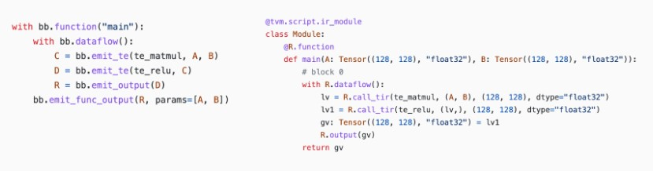

# Lesson5 与机器学习框架的整合

本节课大纲：

1. 通过张量表达式（te）构建TensorIR（即`@T.prim_func`）
2. 使用BlockBuilder构造IRModule

## 5.1 通过张量表达式构建TensorIR

回顾使用张量表达式 (tensor expression, TE)来构建TensorIR函数

**（1）创建输入**

```python
from tvm import te

# 表示TensorIR的输入
A = te.placeholder((128, 128), name="A", dtype="float32")
B = te.placeholder((128, 128), name="B", dtype="float32")
```

这里的A和B的类型都是`te.Tensor`对象，每个`te.Tensor`都有一个`shape`字段和`dtype`字段

> TE 当中，tvm.te.Tensor 是指计算图中的某个数据块，概念类似于神经网络中的一个 feature map。例如，神经网络的 RGB Input 就是一个 Tensor；神经网络中 Conv、Pooling 算子的计算结果也是一个 Tensor。

**（2）描述计算过程**

```python
def te_matmul(A: te.Tensor, B: te.Tensor) -> te.Tensor:
    assert A.shape[1] == B.shape[0]
    n = A.shape[0]
    m = B.shape[1]
    k = te.reduce_axis((0, A.shape[1]), name="k")
    return te.compute((n, m), lambda i, j: te.sum(A[i, k] * B[k, j], axis=k), name="matmul")

C = te_matmul(A, B)
```

这里使用到了`te.compute`这样的接口，从一个或者多个前序节点接收数据，并按初始化的时候传入的 lambda 表达式计算 Tensor 内的数据。

之后我们使用`te_matmul`使用A和B获得计算结果，至此完成了计算图的描述。

**（3）创建TensorIR函数**

```python
te.create_prim_func([A, B, C]).show()
```

可以调用 `te.create_prim_func` 并传入输入和输出值，至此生成一个TensorIR函数

利用类似的方法，我们可以为`ReLu`生成一个张量表达式

```python
def te_relu(A: te.Tensor) -> te.Tensor:
    return te.compute(A.shape, lambda *i: te.max(A(*i), 0), name="relu")
    
X1 = te.placeholder((10,), name="X1", dtype="float32")
Y1 = te_relu(X1)
te.create_prim_func([X1, Y1]).show()
```

**（4）算子融合**

`te API` 允许我们做的另一件事是组合操作并创建“融合 (fused)”算子。例如，我们可以将 matmul 的结果再次应用 relu。

```python
C = te_matmul(A, B)
D = te_relu(C)
```

我们可以通过只传递感兴趣的输入和输出值，跳过中间值来创建一个 TensorIR 函数。 这将导致 matmul 的结果被分配为 TensorIR 函数中的临时空间（**TensorIR函数中会出现中间结果分配函数：matmul = T.alloc_buffer((128, 128))的语句**）

```python
te.create_prim_func([A, B, D]).show()
```

我们还可以**将中间结果 C 传递到参数列表中**。在这种情况下，TensorIR 函数希望我们也从调用方传入 C。通常我们建议只传入输入和输出，这样我们就可以在里面进行更高级的融合。

```
te.create_prim_func([A, B, C, D]).show()
```

## 5.2 使用BlockBuilder构造IRModule

目前我们已经构建了一个TensorIR函数，为了构建端到端的模型执行，我们还需要能够通过计算图连接多个TensorIR函数。

我们可以创建一个`block builder`，它可以帮助我们逐步构建一个`relax.Function`。

```python
A = relax.Var("A", relax.TensorStructInfo((128, 128), "float32"))
B = relax.Var("B", relax.TensorStructInfo((128, 128), "float32"))

bb = relax.BlockBuilder()

with bb.function("main"):
    with bb.dataflow():
        C = bb.emit_te(te_matmul, A, B)
        D = bb.emit_te(te_relu, C)
        R = bb.emit_output(D)
    bb.emit_func_output(R, params=[A, B])

MyModule = bb.get()
MyModule.show()
```

终端得到的输出为

```python
# from tvm.script import ir as I
# from tvm.script import tir as T
# from tvm.script import relax as R

@I.ir_module
class Module:
    @T.prim_func
    def te_matmul(rxplaceholder: T.Buffer((T.int64(128), T.int64(128)), "float32"), rxplaceholder_1: T.Buffer((T.int64(128), T.int64(128)), "float32"), matmul: T.Buffer((T.int64(128), T.int64(128)), "float32")):
        T.func_attr({"tir.noalias": True})
        # with T.block("root"):
        for i, j, k in T.grid(T.int64(128), T.int64(128), T.int64(128)):
            with T.block("matmul"):
                v_i, v_j, v_k = T.axis.remap("SSR", [i, j, k])
                T.reads(rxplaceholder[v_i, v_k], rxplaceholder_1[v_k, v_j])
                T.writes(matmul[v_i, v_j])
                with T.init():
                    matmul[v_i, v_j] = T.float32(0)
                matmul[v_i, v_j] = matmul[v_i, v_j] + rxplaceholder[v_i, v_k] * rxplaceholder_1[v_k, v_j]

    @T.prim_func
    def te_relu(rxplaceholder: T.Buffer((T.int64(128), T.int64(128)), "float32"), relu: T.Buffer((T.int64(128), T.int64(128)), "float32")):
        T.func_attr({"tir.noalias": True})
        # with T.block("root"):
        for i0, i1 in T.grid(T.int64(128), T.int64(128)):
            with T.block("relu"):
                v_i0, v_i1 = T.axis.remap("SS", [i0, i1])
                T.reads(rxplaceholder[v_i0, v_i1])
                T.writes(relu[v_i0, v_i1])
                relu[v_i0, v_i1] = T.max(rxplaceholder[v_i0, v_i1], T.float32(0))

    @R.function
    def main(A: R.Tensor((128, 128), dtype="float32"), B: R.Tensor((128, 128), dtype="float32")) -> R.Tensor((128, 128), dtype="float32"):
        cls = Module
        with R.dataflow():
            lv = R.call_tir(cls.te_matmul, (A, B), out_sinfo=R.Tensor((128, 128), dtype="float32"))
            lv1 = R.call_tir(cls.te_relu, (lv,), out_sinfo=R.Tensor((128, 128), dtype="float32"))
            gv: R.Tensor((128, 128), dtype="float32") = lv1
            R.output(gv)
        return gv
```

## 5.3 深入理解 BlockBuilder API

对比`BlockBuilder`代码和生成的`IRModule`



`BlockBuilder `带有与 `Relax` 函数中相应的作用域。例如，`bb.dataflow()` 创建一个 `dataflow block`，其中所有对 `BlockBuilder` 的调用都处在 `dataflow block` 的作用域中。

其中每个中间结果都是一个`relax.Var`，对应一个存储计算结果的变量。

```python
type(C)

tvm.relax.expr.DataflowVar #  DataflowVar表示该变量是dataflow block（和计算图）内的中间步骤

isinstance(C, relax.Var)

True
```

Relax 函数中的每一行都是由 `emit_te` 调用生成的。 例如，

```python
lv = R.call_dps_packed(te_matmul, (A, B), (128, 128), dtype="float32")
```

是由如下代码所生成

```python
C = bb.emit_te(te_matmul, A, B).
```

综上所述，`bb.emit_te`做了以下事情：

- 为 A 和 B 创建一个输入 `te.placeholder`。
- 通过 `te_matmul` 函数运行它们（构建计算图？）
- 调用 `te.create_prim_func` 来创建一个 TensorIR 函数。
- 通过 `call_dps_packed` 生成对函数的调用。

值得注意的是我们有两种方式来指定函数的参数列表：

方式一：

```python
with bb.function("main"):
    ...
    # specify parameters in the end
    bb.emit_func_output(R, params=[A, B])
```

方式二：

```python
# specify parameters in the beginning.
with bb.function("main", params=[A, B]):
    ...
    bb.emit_func_output(R)
```

## 5.4 从 PyTorch 导入模型

前文已经学习了以编程方式构建 IRModule 的工具，现在我们将使用它们将机器学习模型从 `Pytorch`导入成为`IRModule`。

大多数机器学习框架都带有计算图抽象，其中每个节点对应一个操作，边对应它们之间的依赖关系。 我们将采用 `PyTorch` 模型，获取 `PyTorch` 原生格式的计算图，并将其转换为` IRModule`。

模型定义如下，示例为一个`matmul`+`ReLU`

```python
class MyModel(nn.Module):
    def __init__(self):
        super(MyModel, self).__init__()
        self.weight = nn.Parameter(torch.randn(128, 128))

    def forward(self, x):
        x = torch.matmul(x, self.weight)
        x = torch.relu(x)
        return x
```

### 5.4.1 创建 TorchFX GraphModule

使用`TorchFX`来表示来自`PyTorch`的模型的计算图

```python
model = MyModel()
fx_module = fx.symbolic_trace(model)
type(fx_module)

# fx_module 包含一个简单的计算图，可以打印成表格便于查看。
fx_module.graph.print_tabular()
```

我们的目标是将这个计算图转化成`IRModule`

### 5.4.2 构造映射函数

让我们定义整体的翻译逻辑。 主要流程如下：

- 创建一个 `node_map`，将 `fx.Node` 映射到相应的 `relax.Var`，该 `relax.Var` 代表 IRModule 中的已翻译节点。
- 以拓扑顺序迭代 FX 图中的节点。
- 给定映射输入，获取节点的映射输出。

```python
def map_param(param: nn.Parameter):
    return relax.const(
        param.data.cpu().numpy(), relax.TensorStructInfo(param.data.shape, "float32")
    )

def fetch_attr(fx_mod, target: str):
    """Helper function to fetch an attr"""
    target_atoms = target.split('.')
    attr_itr = fx_mod
    for i, atom in enumerate(target_atoms):
        if not hasattr(attr_itr, atom):
            raise RuntimeError(f"Node referenced nonexistant target {'.'.join(target_atoms[:i])}")
        attr_itr = getattr(attr_itr, atom)
    return attr_itr

def from_fx(fx_mod, input_shapes, call_function_map, call_module_map):
    input_index = 0
    node_map = {}
    named_modules = dict(fx_mod.named_modules())

    bb = relax.BlockBuilder()

    fn_inputs = []
    fn_output = None
    with bb.function("main"):
        with bb.dataflow():
            for node in fx_mod.graph.nodes:
                if node.op == "placeholder":
                    # create input placeholder
                    shape = input_shapes[input_index]
                    input_index += 1
                    input_var = relax.Var(
                        node.target, relax.TensorStructInfo(shape, "float32")
                    )
                    fn_inputs.append(input_var)
                    node_map[node] = input_var
                elif node.op == "get_attr":
                    node_map[node] = map_param(fetch_attr(fx_mod, node.target))
                elif node.op == "call_function":
                    node_map[node] = call_function_map[node.target](bb, node_map, node)
                elif node.op == "call_module":
                    named_module = named_modules[node.target]
                    node_map[node] = call_module_map[type(named_module)](bb, node_map, node, named_module)
                elif node.op == "output":
                    output = node_map[node.args[0]]
                    assert fn_output is None
                    fn_output = bb.emit_output(output)
        # output and finalize the function
        bb.emit_func_output(output, fn_inputs)
    return bb.get()
```

我们没有在 `from_fx` 函数中定义函数映射。 我们将通过映射提供每个 torch function 的翻译规则。 具体来说，以下代码块显示了我们如何通过 `emit_te` API 做到这一点。

```python
def map_matmul(bb, node_map, node: fx.Node):
    A = node_map[node.args[0]]
    B = node_map[node.args[1]]
    return bb.emit_te(te_matmul, A, B)

def map_relu(bb, node_map, node: fx.Node):
    A = node_map[node.args[0]]
    return bb.emit_te(te_relu, A)

MyModule = from_fx(
    fx_module,
    input_shapes = [(1, 128)],
    call_function_map = {
      torch.matmul: map_matmul,
      torch.relu: map_relu,
    },
    call_module_map={},
)

MyModule.show()
```

## 5.5 FashionMNIST示例

```python
import torch
import torchvision

test_data = torchvision.datasets.FashionMNIST(
    root="data",
    train=False,
    download=True,
    transform=torchvision.transforms.ToTensor()
)
test_loader = torch.utils.data.DataLoader(test_data, batch_size=1, shuffle=True)
class_names = ['T-shirt/top', 'Trouser', 'Pullover', 'Dress', 'Coat',
               'Sandal', 'Shirt', 'Sneaker', 'Bag', 'Ankle boot']

img, label = next(iter(test_loader))
img = img.reshape(1, 28, 28).numpy()

# Hide outputs
!wget -nc https://github.com/mlc-ai/web-data/raw/main/models/fasionmnist_mlp_params.pkl

class MLP(nn.Module):
    def __init__(self):
        super(MLP, self).__init__()
        self.linear0 = nn.Linear(784, 128, bias=True)
        self.relu = nn.ReLU()
        self.linear1 = nn.Linear(128, 10, bias=True)

    def forward(self, x):
        x = self.linear0(x)
        x = self.relu(x)
        x = self.linear1(x)
        return x

import pickle as pkl

mlp_model = MLP()

mlp_params = pkl.load(open("fasionmnist_mlp_params.pkl", "rb"))
mlp_model.linear0.weight.data = torch.from_numpy(mlp_params["w0"])
mlp_model.linear0.bias.data = torch.from_numpy(mlp_params["b0"])
mlp_model.linear1.weight.data = torch.from_numpy(mlp_params["w1"])
mlp_model.linear1.bias.data = torch.from_numpy(mlp_params["b1"])

torch_res = mlp_model(torch.from_numpy(img.reshape(1, 784)))

pred_kind = np.argmax(torch_res.detach().numpy(), axis=1)
print("Torch Prediction:", class_names[pred_kind[0]])

from tvm import topi


def map_nn_linear(bb, node_map, node, nn_mod):
    x = node_map[node.args[0]]
    w = map_param(nn_mod.weight)
    if nn_mod.bias is not None:
        b = map_param(nn_mod.bias)
    y = bb.emit_te(topi.nn.dense, x, w)
    return bb.emit_te(topi.add, y, b)

def map_nn_relu(bb, node_map, node, nn_mod):
    return map_relu(bb, node_map, node)


MLPModule = from_fx(
    fx.symbolic_trace(mlp_model),
    input_shapes = [(1, 784)],
    call_function_map={
    },
    call_module_map={
        torch.nn.Linear: map_nn_linear,
        torch.nn.ReLU: map_nn_relu,
    },
)

MLPModule.show()
```