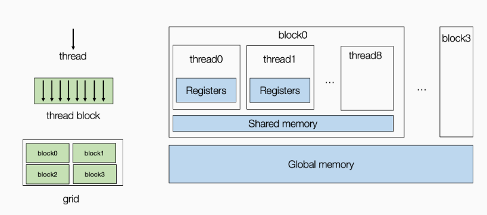
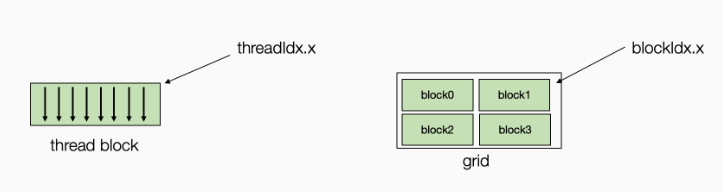
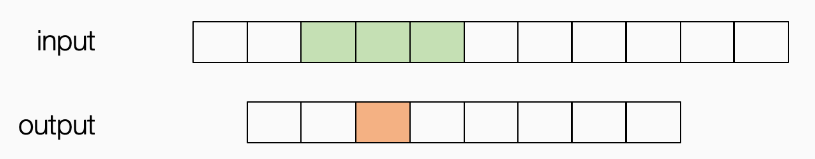
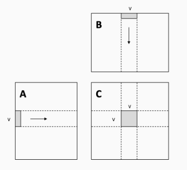

# Lesson6 GPU硬件加速

## 6.1 GPU体系结构

这里只做简单介绍，GPU的内存包括**全局内存（global memory）**和**共享内存（shared memory）**，共享内存位于**流处理器**上，流处理器包含多个**核心**，每个核心对应一个**线程**，同一个流处理器上的线程共享一片内存称为共享内存，而**全局内存**可以为所有流处理器所访问。注意：不同流处理器上的线程间的通信仅能通过全局内存。示意图如下图所示：



 对于计算任务，我们可以将其绑定在GPU线程上，每个线程由两个索引进行表示`threadIdx.x`和`blockIdx.x`。在实际应用中，我们可以有多维线程索引，但这里我们为了简化问题，将它们固定为一维表示。



## 6.2 示例：窗口求和

 这个程序可以被视为具有预定义权重 `[1,1,1]` 的“卷积“的基本版本。 我们对输入进行滑动并将三个相邻值相加。



原TensorIR函数如下：

```python
@tvm.script.ir_module
class MyModuleWindowSum:
    @T.prim_func
    def main(A: T.Buffer[(1027,), "float32"],
             B: T.Buffer[(1024,), "float32"]) -> None:
        T.func_attr({"global_symbol": "main", "tir.noalias": True})
        for i in T.grid(1024):
            with T.block("C"):
                vi = T.axis.remap("S", [i])
                B[vi] = A[vi] + A[vi + 1] + A[vi + 2]
```

首先可以将循环绑定到GPU线程

```python
sch = tvm.tir.Schedule(MyModuleWindowSum)
nthread = 128
block_C = sch.get_block("C")
i,  = sch.get_loops(block=block_C)
i0, i1 = sch.split(i, [None, nthread])
sch.bind(i0, "blockIdx.x")
sch.bind(i1, "threadIdx.x")
sch.mod.show()
```

此时的IR函数为：

```python
# from tvm.script import ir as I
# from tvm.script import tir as T

@I.ir_module
class Module:
    @T.prim_func
    def main(A: T.Buffer((1027,), "float32"), B: T.Buffer((1024,), "float32")):
        T.func_attr({"global_symbol": "main", "tir.noalias": True})
        # with T.block("root"):
        for i_0 in T.thread_binding(8, thread="blockIdx.x"):
            for i_1 in T.thread_binding(128, thread="threadIdx.x"):
                with T.block("C"):
                    vi = T.axis.spatial(1024, i_0 * 128 + i_1)
                    T.reads(A[vi:vi + 3])
                    T.writes(B[vi])
                    B[vi] = A[vi] + A[vi + 1] + A[vi + 2]
```

我们注意到，在这种情况下有数据复用的机会。例如对于GPU线程0，他需要读取input的第0、1、2块，而对于GPU线程1则需要读取input的第1、2、3块，以此类推存在大量数据的重复读取。我们可以将整个input从`global memory`读取到每个线程块共享的`shared memory`。我们使用`cache_read`添加一个中间阶段，将部分数据（下面绿色）缓存到共享内存上。 

```python
A_shared = sch.cache_read(block_C, read_buffer_index=0, storage_scope="shared")
sch.compute_at(A_shared, i1)
sch.mod.show()
```

经过这样的变换后，现在的TensorIR函数为：

```python
# from tvm.script import ir as I
# from tvm.script import tir as T

@I.ir_module
class Module:
    @T.prim_func
    def main(A: T.Buffer((1027,), "float32"), B: T.Buffer((1024,), "float32")):
        T.func_attr({"global_symbol": "main", "tir.noalias": True})
        # with T.block("root"):
        A_shared = T.alloc_buffer((1027,), scope="shared")
        for i_0 in T.thread_binding(8, thread="blockIdx.x"):
            for i_1 in T.thread_binding(128, thread="threadIdx.x"):
                for ax0 in range(130): # 这里的130是因为每个线程块有128线程，需要130input
                    with T.block("A_shared"):
                        v0 = T.axis.spatial(1027, i_0 * 128 + ax0)
                        T.reads(A[v0])
                        T.writes(A_shared[v0])
                        A_shared[v0] = A[v0]
                with T.block("C"):
                    vi = T.axis.spatial(1024, i_0 * 128 + i_1)
                    T.reads(A_shared[vi:vi + 3])
                    T.writes(B[vi])
                    B[vi] = A_shared[vi] + A_shared[vi + 1] + A_shared[vi + 2]
```

因为内存是跨线程共享的，所以我们需要重新拆分循环并将获取过程的**内部迭代器绑定到线程索引上**。这种技术称为 **cooperative fetching**，其中**多个线程一起工作以将数据带到共享内存中**。下面的读取过程会与之前不同。

```python
ax = sch.get_loops(A_shared)[-1]
ax0, ax1 = sch.split(ax, [None, nthread])
sch.bind(ax1, "threadIdx.x")
sch.mod.show()
```

输出结果如下，尤其注意第13行和第14行的变化，这其中只有两个线程需要读取两次。

```python
# from tvm.script import ir as I
# from tvm.script import tir as T

@I.ir_module
class Module:
    @T.prim_func
    def main(A: T.Buffer((1027,), "float32"), B: T.Buffer((1024,), "float32")):
        T.func_attr({"global_symbol": "main", "tir.noalias": True})
        # with T.block("root"):
        A_shared = T.alloc_buffer((1027,), scope="shared")
        for i_0 in T.thread_binding(8, thread="blockIdx.x"):
            for i_1 in T.thread_binding(128, thread="threadIdx.x"):
                for ax0_0 in range(2):
                    for ax0_1 in T.thread_binding(128, thread="threadIdx.x"):
                        with T.block("A_shared"):
                            v0 = T.axis.spatial(1027, i_0 * 128 + (ax0_0 * 128 + ax0_1))
                            T.where(ax0_0 * 128 + ax0_1 < 130)
                            T.reads(A[v0])
                            T.writes(A_shared[v0])
                            A_shared[v0] = A[v0]
                with T.block("C"):
                    vi = T.axis.spatial(1024, i_0 * 128 + i_1)
                    T.reads(A_shared[vi:vi + 3])
                    T.writes(B[vi])
                    B[vi] = A_shared[vi] + A_shared[vi + 1] + A_shared[vi + 2]
```

## 6.3 矩阵乘法示例

原始矩阵乘法的IRModule如下：

```python
@tvm.script.ir_module
class MyModuleMatmul:
    @T.prim_func
    def main(A: T.Buffer((1024, 1024), "float32"),
             B: T.Buffer((1024, 1024), "float32"),
             C: T.Buffer((1024, 1024), "float32")) -> None:
        T.func_attr({"global_symbol": "main", "tir.noalias": True})
        for i, j, k in T.grid(1024, 1024, 1024):
            with T.block("C"):
                vi, vj, vk = T.axis.remap("SSR", [i, j, k])
                with T.init():
                    C[vi, vj] = 0.0
                C[vi, vj] = C[vi, vj] + A[vi, vk] * B[vk, vj]
```

### 6.3.1 本地存储分块

这种本地存储的切分有助于减少内存压力，因为条形数据块的每个元素都被重用了 `V` 次。最直接的影响就是`cache`的命中率。



```python
def blocking(sch,
             tile_local_y,
             tile_local_x,
             tile_block_y,
             tile_block_x,
             tile_k):
    block_C = sch.get_block("C")
    # 将block_C的计算结果写在本地缓存中
    C_local = sch.cache_write(block_C, 0, "local")

    i, j, k = sch.get_loops(block=block_C)

    # (i0,j0)线程块号，(i1,j1)线程号，i2*j2计算的子矩阵大小
    i0, i1, i2 = sch.split(loop=i, factors=[None, tile_block_y, tile_local_y])
    j0, j1, j2 = sch.split(loop=j, factors=[None, tile_block_x, tile_local_x])
    k0, k1 = sch.split(loop=k, factors=[None, tile_k])
    sch.unroll(k1)
    sch.reorder(i0, j0, i1, j1, k0, k1, i2, j2)
    
    # 将C_local的写回操作挂到j1循环下
    sch.reverse_compute_at(C_local, j1)

    sch.bind(i0, "blockIdx.y")
    sch.bind(j0, "blockIdx.x")

    sch.bind(i1, "threadIdx.y")
    sch.bind(j1, "threadIdx.x")
    
    # 分离计算和初始化操作
    sch.decompose_reduction(block_C, k0)

    return sch

sch = tvm.tir.Schedule(MyModuleMatmul)
# 16*16个线程块，每块8*8个线程，每个线程计算的子矩阵大小为8*8
sch = blocking(sch, 8, 8, 8, 8, 4)
sch.mod.show()
```

一起加入光荣的进化吧！

```python
# from tvm.script import ir as I
# from tvm.script import tir as T

@I.ir_module
class Module:
    @T.prim_func
    def main(A: T.Buffer((1024, 1024), "float32"), B: T.Buffer((1024, 1024), "float32"), C: T.Buffer((1024, 1024), "float32")):
        T.func_attr({"global_symbol": "main", "tir.noalias": True})
        # with T.block("root"):
        C_local = T.alloc_buffer((1024, 1024), scope="local")
        for i_0 in T.thread_binding(16, thread="blockIdx.y"):
            for j_0 in T.thread_binding(16, thread="blockIdx.x"):
                for i_1 in T.thread_binding(8, thread="threadIdx.y"):
                    for j_1 in T.thread_binding(8, thread="threadIdx.x"):
                        for i_2_init, j_2_init in T.grid(8, 8):
                            with T.block("C_init"):
                                vi = T.axis.spatial(1024, i_0 * 64 + i_1 * 8 + i_2_init)
                                vj = T.axis.spatial(1024, j_0 * 64 + j_1 * 8 + j_2_init)
                                T.reads()
                                T.writes(C_local[vi, vj])
                                C_local[vi, vj] = T.float32(0)
                        for k_0 in range(256):
                            for k_1 in T.unroll(4):
                                for i_2, j_2 in T.grid(8, 8):
                                    with T.block("C_update"):
                                        vi = T.axis.spatial(1024, i_0 * 64 + i_1 * 8 + i_2)
                                        vj = T.axis.spatial(1024, j_0 * 64 + j_1 * 8 + j_2)
                                        vk = T.axis.reduce(1024, k_0 * 4 + k_1)
                                        T.reads(C_local[vi, vj], A[vi, vk], B[vk, vj])
                                        T.writes(C_local[vi, vj])
                                        C_local[vi, vj] = C_local[vi, vj] + A[vi, vk] * B[vk, vj]
                        for ax0, ax1 in T.grid(8, 8):
                            with T.block("C_local"):
                                v0 = T.axis.spatial(1024, i_0 * 64 + i_1 * 8 + ax0)
                                v1 = T.axis.spatial(1024, j_0 * 64 + j_1 * 8 + ax1)
                                T.reads(C_local[v0, v1])
                                T.writes(C[v0, v1])
                                C[v0, v1] = C_local[v0, v1]
```

运行测试：

```python
rt_mod = tvm.build(sch.mod, target="cuda")
dev = tvm.cuda(0)
A_np = np.random.uniform(size=(1024, 1024)).astype("float32")
B_np = np.random.uniform(size=(1024, 1024)).astype("float32")
A_nd = tvm.nd.array(A_np, dev)
B_nd = tvm.nd.array(B_np, dev)
C_nd = tvm.nd.array(np.zeros((1024, 1024), dtype="float32"), dev)

num_flop = 2 * 1024 * 1024 * 1024
evaluator = rt_mod.time_evaluator("main", dev, number=10)

print("GEMM-Blocking: %f GFLOPS" % (num_flop / evaluator(A_nd, B_nd, C_nd).mean / 1e9))
```

### 6.3.2 共享内存分块

见[MLC Lesson8 矩阵乘法样例分析.md](MLC-Lesson6-矩阵乘法样例分析.md)

## 6.4 利用自动程序优化

```python
from tvm import meta_schedule as ms

database = ms.tune_tir(
    mod=MyModuleMatmul,
    target="nvidia/tesla-p100",
    max_trials_global=64,
    num_trials_per_iter=64,
    work_dir="./tune_tmp",
    task_name="main"
)
sch = ms.tir_integration.compile_tir(database, MyModuleMatmul, "nvidia/tesla-p100")
sch.mod.show()
```

```python
rt_mod = tvm.build(sch.mod, target="nvidia/tesla-p100")
dev = tvm.cuda(0)
evaluator = rt_mod.time_evaluator("main", dev, number=10)

print("MetaSchedule: %f GFLOPS" % (num_flop / evaluator(A_nd, B_nd, C_nd).mean / 1e9))
```