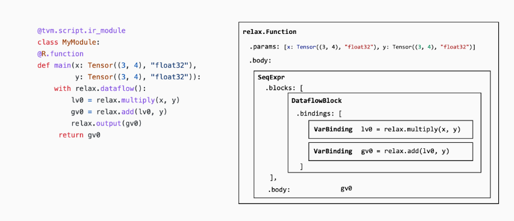

# Lesson8 计算图优化

在过去的章节中主要研究了如何单独变换每个元张量函数。在本章中主要讨论计算图之间的高层变换。

## 8.1 模式匹配与改写

`MyModule` 包含一个带有两个图层 op 的 relax 函数，其中包含 `relax.op.multiply` 和`relax.op.add`。我们的目标是找到这两个运算符并将它们替换为一个 `relax.op.ewise_fma` 运算符的调用。

```python
@tvm.script.ir_module
class MyModule:
    @R.function
    def main(x: R.Tensor((3, 4), "float32"), y: R.Tensor((3, 4), "float32")):
        with R.dataflow():
            lv0 = relax.op.multiply(x, y)
            gv0 = relax.op.add(lv0, y)
            R.output(gv0)
        return gv0
```

我们先检查`MyModule`的数据结构：

1. 每个`IRModule`都包含一组函数，函数体由一组称为`抽象语法树（AST）`的数据结构组成。
2. 每个函数都由一个`relax.expr.Function`节点表示
   1. 函数包含一系列参数
   2. 函数包含一个返回值表达式，和函数中的一组 binding blocks
   3. 函数主体 `SeqExpr` 包含一系列 binding
   4. 在我们的特定情况下，我们有一个数据流块，其中包含两个 Binding 。
3. binding
   1. 每个 binding 都有一个对应于绑定左侧的 var，如上例中的lv0，gv0
   2. 每个 binding 的右侧是他的 value，对应一个 `relax.Call` 节点

总结如下图所示



改写程序可以通过递归遍历`MyModule`的AST，并生成转换后的AST来实现。我们使用一种称为**访问者模式（visitor pattern）**的设计模式，它允许我们访问每个AST节点并将它们重写为转换后的版本。

以下例子的思路是：找到`add`算子将它替换成我们融合`multiply`算子和`add`算子之后的`fma`算子，然后再删除`mutiply`算子

```python
@relax.expr_functor.mutator
class EwiseFMARewriter(relax.PyExprMutator):
    def visit_call_(self, call):
        # 。。。
        call = self.visit_expr_post_order(call)

        # 获得对应的单元算子
        add_op = tvm.ir.Op.get("relax.add")
        multiply_op = tvm.ir.Op.get("relax.multiply")
        ewise_fma_op = tvm.ir.Op.get("relax.ewise_fma")

        # 这个操作是否是一个加法
        if call.op != add_op:
            return call

        # 判断加法的第0个操作是否对应于一个乘法
        # 这里lookup_binding的作用是查找lv0的binding是否是一个
        value = self.lookup_binding(call.args[0])
        if not isinstance(value, relax.Call) or value.op != multiply_op:
            return call

        # 前面条件都满足加法操作替换成乘加操作
        fma_call = relax.Call(
            ewise_fma_op, [value.args[0], value.args[1], call.args[1]], None, None
        )
        return fma_call

# 执行更新操作
updated_fn = EwiseFMARewriter().visit_expr(MyModule["main"])
# 删除多余的mutiply算子
relax.analysis.remove_all_unused(updated_fn).show()
updated_fn.show()
```

经过变换后我们得到的结果是

```python
# from tvm.script import relax as R

@R.function
def main(x: R.Tensor((3, 4), dtype="float32"), y: R.Tensor((3, 4), dtype="float32")) -> R.Tensor((3, 4), dtype="float32"):
    with R.dataflow():
        gv0: R.Tensor((3, 4), dtype="float32") = R.ewise_fma(x, y, y)
        R.output(gv0)
    return gv0
```

## 8.2 融合 Linear 和 ReLU算子

我们先利用`BlockBuilder`构建模型

```python
def create_model():
    bb = relax.BlockBuilder()
    x = relax.Var("x", relax.TensorStructInfo((1, 784), "float32"))
    w0 = relax.const(mlp_params["w0"], "float32")
    b0 = relax.const(mlp_params["b0"], "float32")
    w1 = relax.const(mlp_params["w1"], "float32")
    b1 = relax.const(mlp_params["b1"], "float32")
    with bb.function("main", [x]):
        with bb.dataflow():
            lv0 = bb.emit(relax.op.matmul(x, relax.op.permute_dims(w0)))
            lv1 = bb.emit(relax.op.add(lv0, b0))
            lv2 = bb.emit(relax.op.nn.relu(lv1))
            lv3 = bb.emit(relax.op.matmul(lv2, relax.op.permute_dims(w1)))
            lv4 = bb.emit(relax.op.add(lv3, b1))
            gv = bb.emit_output(lv4)
        bb.emit_func_output(gv)

    return bb.get()

MLPModel = create_model()
MLPModel.show()
```

得到的`IRModule`如下：

```python
# from tvm.script import ir as I
# from tvm.script import relax as R

@I.ir_module
class Module:
    @R.function
    def main(x: R.Tensor((1, 784), dtype="float32")) -> R.Tensor((1, 10), dtype="float32"):
        with R.dataflow():
            lv: R.Tensor((784, 128), dtype="float32") = R.permute_dims(metadata["relax.expr.Constant"][0], axes=None)
            lv1: R.Tensor((1, 128), dtype="float32") = R.matmul(x, lv, out_dtype="void")
            lv2: R.Tensor((1, 128), dtype="float32") = R.add(lv1, metadata["relax.expr.Constant"][1])
            lv3: R.Tensor((1, 128), dtype="float32") = R.nn.relu(lv2)
            lv4: R.Tensor((128, 10), dtype="float32") = R.permute_dims(metadata["relax.expr.Constant"][2], axes=None)
            lv5: R.Tensor((1, 10), dtype="float32") = R.matmul(lv3, lv4, out_dtype="void")
            lv6: R.Tensor((1, 10), dtype="float32") = R.add(lv5, metadata["relax.expr.Constant"][3])
            gv: R.Tensor((1, 10), dtype="float32") = lv6
            R.output(gv)
        return gv

# Metadata omitted. Use show_meta=True in script() method to show it.
```

我们的目标是“融合” `matmul` 和 `add` 算子到一起。 以下代码通过以下步骤实现：

- 识别 `matmul` 和 `add` 算子。
- 生成另一个调用 `matmul` 和 `add` 算子的子函数。
- 将 `matmul` 和 `add` 替换为融合后的子函数。

```python
@relax.expr_functor.mutator
class MatmulAddFusor(relax.PyExprMutator):
    def __init__(self, mod: IRModule) -> None:
        super().__init__()
        self.mod_ = mod
        # cache pre-defined ops
        self.add_op = tvm.ir.Op.get("relax.add")
        self.matmul_op = tvm.ir.Op.get("relax.matmul")
        self.counter = 0

    def transform(self) -> IRModule:
        for global_var, func in self.mod_.functions.items():
            # 目标是Relax Function，不是就跳过
            if not isinstance(func, relax.Function):
                continue
            # avoid already fused primitive functions
            if func.attrs is not None and "Primitive" in func.attrs.keys() and func.attrs["Primitive"] != 0:
                continue
            updated_func = self.visit_expr(func)
            updated_func = relax.analysis.remove_all_unused(updated_func)
            self.builder_.update_func(global_var, updated_func)

        return self.builder_.get()

    def visit_call_(self, call):
        call = self.visit_expr_post_order(call)

        def match_call(node, op):
            if not isinstance(node, relax.Call):
                return False
            return node.op == op

        # pattern match matmul => add
        if not match_call(call, self.add_op):
            return call

        value = self.lookup_binding(call.args[0])
        if value is None:
            return call

        if not match_call(value, self.matmul_op):
            return call

        x = value.args[0]
        w = value.args[1]
        b = call.args[1]

        # construct a new fused primitive function
        param_x = relax.Var("x" ,relax.TensorStructInfo(x.struct_info.shape, x.struct_info.dtype))
        param_w = relax.Var("w" ,relax.TensorStructInfo(w.struct_info.shape, w.struct_info.dtype))
        param_b = relax.Var("b" ,relax.TensorStructInfo(b.struct_info.shape, b.struct_info.dtype))

        bb = relax.BlockBuilder()

        fn_name = "fused_matmul_add%d" % (self.counter)
        self.counter += 1
        with bb.function(fn_name, [param_x, param_w, param_b]):
            with bb.dataflow():
                lv0 = bb.emit(relax.op.matmul(param_x, param_w))
                gv = bb.emit_output(relax.op.add(lv0, param_b))
            bb.emit_func_output(gv)

        # Add Primitive attribute to the fused funtions
        fused_fn = bb.get()[fn_name].with_attr("Primitive", 1)
        global_var = self.builder_.add_func(fused_fn, fn_name)

        # construct call into the fused function
        return relax.Call(global_var, [x, w, b], None, None)

@tvm.ir.transform.module_pass(opt_level=2, name="MatmulAddFuse")
class FuseDenseAddPass:
    """The wrapper for the LowerTensorIR pass."""
    def transform_module(self, mod, ctx):
        return MatmulAddFusor(mod).transform()


MLPFused = FuseDenseAddPass()(MLPModel)
MLPFused.show()
```

**注意：**`visit_call_`方法是类`MatmulAddFusor`中的一个重载方法，用于处理调用表达式。在这个示例中，`MatmulAddFusor`类继承自`relax.PyExprMutator`，而`relax.PyExprMutator`类定义了一个通用的访问表达式的接口，其中包括`visit_call_`方法用于处理调用表达式。在`MatmulAddFusor`类中，我们通过重载`visit_call_`方法来实现特定的变换逻辑，从而达到我们想要的功能。

结果如下：

```python
# from tvm.script import ir as I
# from tvm.script import relax as R

@I.ir_module
class Module:
    @R.function
    def fused_matmul_add0(x: R.Tensor((1, 784), dtype="float32"), w: R.Tensor((784, 128), dtype="float32"), b: R.Tensor((128,), dtype="float32")) -> R.Tensor((1, 128), dtype="float32"):
        R.func_attr({"Primitive": 1})
        with R.dataflow():
            lv: R.Tensor((1, 128), dtype="float32") = R.matmul(x, w, out_dtype="void")
            gv: R.Tensor((1, 128), dtype="float32") = R.add(lv, b)
            R.output(gv)
        return gv

    @R.function
    def fused_matmul_add1(x: R.Tensor((1, 128), dtype="float32"), w: R.Tensor((128, 10), dtype="float32"), b: R.Tensor((10,), dtype="float32")) -> R.Tensor((1, 10), dtype="float32"):
        R.func_attr({"Primitive": 1})
        with R.dataflow():
            lv: R.Tensor((1, 10), dtype="float32") = R.matmul(x, w, out_dtype="void")
            gv: R.Tensor((1, 10), dtype="float32") = R.add(lv, b)
            R.output(gv)
        return gv

    @R.function
    def main(x: R.Tensor((1, 784), dtype="float32")) -> R.Tensor((1, 10), dtype="float32"):
        cls = Module
        with R.dataflow():
            lv: R.Tensor((784, 128), dtype="float32") = R.permute_dims(metadata["relax.expr.Constant"][0], axes=None)
            lv2: R.Tensor((1, 128), dtype="float32") = cls.fused_matmul_add0(x, lv, metadata["relax.expr.Constant"][1])
            lv3: R.Tensor((1, 128), dtype="float32") = R.nn.relu(lv2)
            lv4: R.Tensor((128, 10), dtype="float32") = R.permute_dims(metadata["relax.expr.Constant"][2], axes=None)
            lv6: R.Tensor((1, 10), dtype="float32") = cls.fused_matmul_add1(lv3, lv4, metadata["relax.expr.Constant"][3])
            gv: R.Tensor((1, 10), dtype="float32") = lv6
            R.output(gv)
        return gv

# Metadata omitted. Use show_meta=True in script() method to show it.
```

融合后的 IRModule 仅包含对图层 op 的调用。 **为了进一步进行底层优化和代码生成（TensorIR更接近底层）**，我们需要将这些高级原语运算转换为相应的 TensorIR 函数（或调用库函数）。

以下代码将图层算子重新映射到相应的 TensorIR 函数。 在这里，我们利用 Mutator 中的内部 block builder 并使用 `call_te` 返回转换后的值。

```python
@relax.expr_functor.mutator
class LowerToTensorIR(relax.PyExprMutator):
    def __init__(self, mod: IRModule, op_map) -> None:
        super().__init__()
        self.mod_ = mod
        self.op_map = {
            tvm.ir.Op.get(k): v for k, v in op_map.items()
        }


    def visit_call_(self, call):
        call = self.visit_expr_post_order(call)

        if call.op in self.op_map:
            return self.op_map[call.op](self.builder_, call)
        return call

    def transform(self) -> IRModule:
        for global_var, func in self.mod_.functions.items():
            if not isinstance(func, relax.Function):
                continue
            updated_func = self.visit_expr(func)
            self.builder_.update_func(global_var, updated_func)

        return self.builder_.get()


def map_matmul(bb, call):
    x, w = call.args
    return bb.call_te(topi.nn.matmul, x, w)

def map_add(bb, call):
    a, b = call.args
    return bb.call_te(topi.add, a, b)

def map_relu(bb, call):
    return bb.call_te(topi.nn.relu, call.args[0])

def map_transpose(bb, call):
    return bb.call_te(topi.transpose, call.args[0], )

op_map = {
  "relax.matmul": map_matmul,
  "relax.add": map_add,
  "relax.nn.relu": map_relu,
  "relax.permute_dims": map_transpose
}

@tvm.ir.transform.module_pass(opt_level=0, name="LowerToTensorIR")
class LowerToTensorIRPass:
    """The wrapper for the LowerTensorIR pass."""
    def transform_module(self, mod, ctx):
        return LowerToTensorIR(mod, op_map).transform()


MLPModelTIR = LowerToTensorIRPass()(MLPFused)
MLPModelTIR.show()
```

结果为：

```python
# from tvm.script import ir as I
# from tvm.script import tir as T
# from tvm.script import relax as R

@I.ir_module
class Module:
    @T.prim_func
    def add(rxplaceholder: T.Buffer((T.int64(1), T.int64(128)), "float32"), rxplaceholder_1: T.Buffer((T.int64(128),), "float32"), T_add: T.Buffer((T.int64(1), T.int64(128)), "float32")):
        T.func_attr({"tir.noalias": True})
        # with T.block("root"):
        for ax0, ax1 in T.grid(T.int64(1), T.int64(128)):
            with T.block("T_add"):
                v_ax0, v_ax1 = T.axis.remap("SS", [ax0, ax1])
                T.reads(rxplaceholder[v_ax0, v_ax1], rxplaceholder_1[v_ax1])
                T.writes(T_add[v_ax0, v_ax1])
                T_add[v_ax0, v_ax1] = rxplaceholder[v_ax0, v_ax1] + rxplaceholder_1[v_ax1]

    @T.prim_func
    def add1(rxplaceholder: T.Buffer((T.int64(1), T.int64(10)), "float32"), rxplaceholder_1: T.Buffer((T.int64(10),), "float32"), T_add: T.Buffer((T.int64(1), T.int64(10)), "float32")):
        T.func_attr({"tir.noalias": True})
        # with T.block("root"):
        for ax0, ax1 in T.grid(T.int64(1), T.int64(10)):
            with T.block("T_add"):
                v_ax0, v_ax1 = T.axis.remap("SS", [ax0, ax1])
                T.reads(rxplaceholder[v_ax0, v_ax1], rxplaceholder_1[v_ax1])
                T.writes(T_add[v_ax0, v_ax1])
                T_add[v_ax0, v_ax1] = rxplaceholder[v_ax0, v_ax1] + rxplaceholder_1[v_ax1]

    @T.prim_func
    def matmul(rxplaceholder: T.Buffer((T.int64(1), T.int64(784)), "float32"), rxplaceholder_1: T.Buffer((T.int64(784), T.int64(128)), "float32"), T_matmul_NN: T.Buffer((T.int64(1), T.int64(128)), "float32")):
        T.func_attr({"layout_free_buffers": [1], "tir.noalias": True})
        # with T.block("root"):
        for i, j, k in T.grid(T.int64(1), T.int64(128), T.int64(784)):
            with T.block("T_matmul_NN"):
                v_i, v_j, v_k = T.axis.remap("SSR", [i, j, k])
                T.reads(rxplaceholder[v_i, v_k], rxplaceholder_1[v_k, v_j])
                T.writes(T_matmul_NN[v_i, v_j])
                with T.init():
                    T_matmul_NN[v_i, v_j] = T.float32(0)
                T_matmul_NN[v_i, v_j] = T_matmul_NN[v_i, v_j] + rxplaceholder[v_i, v_k] * rxplaceholder_1[v_k, v_j]

    @T.prim_func
    def matmul1(rxplaceholder: T.Buffer((T.int64(1), T.int64(128)), "float32"), rxplaceholder_1: T.Buffer((T.int64(128), T.int64(10)), "float32"), T_matmul_NN: T.Buffer((T.int64(1), T.int64(10)), "float32")):
        T.func_attr({"layout_free_buffers": [1], "tir.noalias": True})
        # with T.block("root"):
        for i, j, k in T.grid(T.int64(1), T.int64(10), T.int64(128)):
            with T.block("T_matmul_NN"):
                v_i, v_j, v_k = T.axis.remap("SSR", [i, j, k])
                T.reads(rxplaceholder[v_i, v_k], rxplaceholder_1[v_k, v_j])
                T.writes(T_matmul_NN[v_i, v_j])
                with T.init():
                    T_matmul_NN[v_i, v_j] = T.float32(0)
                T_matmul_NN[v_i, v_j] = T_matmul_NN[v_i, v_j] + rxplaceholder[v_i, v_k] * rxplaceholder_1[v_k, v_j]

    @T.prim_func
    def relu(rxplaceholder: T.Buffer((T.int64(1), T.int64(128)), "float32"), compute: T.Buffer((T.int64(1), T.int64(128)), "float32")):
        T.func_attr({"tir.noalias": True})
        # with T.block("root"):
        for i0, i1 in T.grid(T.int64(1), T.int64(128)):
            with T.block("compute"):
                v_i0, v_i1 = T.axis.remap("SS", [i0, i1])
                T.reads(rxplaceholder[v_i0, v_i1])
                T.writes(compute[v_i0, v_i1])
                compute[v_i0, v_i1] = T.max(rxplaceholder[v_i0, v_i1], T.float32(0))

    @T.prim_func
    def transpose(rxplaceholder: T.Buffer((T.int64(128), T.int64(784)), "float32"), T_transpose: T.Buffer((T.int64(784), T.int64(128)), "float32")):
        T.func_attr({"tir.noalias": True})
        # with T.block("root"):
        for ax0, ax1 in T.grid(T.int64(784), T.int64(128)):
            with T.block("T_transpose"):
                v_ax0, v_ax1 = T.axis.remap("SS", [ax0, ax1])
                T.reads(rxplaceholder[v_ax1, v_ax0])
                T.writes(T_transpose[v_ax0, v_ax1])
                T_transpose[v_ax0, v_ax1] = rxplaceholder[v_ax1, v_ax0]

    @T.prim_func
    def transpose1(rxplaceholder: T.Buffer((T.int64(10), T.int64(128)), "float32"), T_transpose: T.Buffer((T.int64(128), T.int64(10)), "float32")):
        T.func_attr({"tir.noalias": True})
        # with T.block("root"):
        for ax0, ax1 in T.grid(T.int64(128), T.int64(10)):
            with T.block("T_transpose"):
                v_ax0, v_ax1 = T.axis.remap("SS", [ax0, ax1])
                T.reads(rxplaceholder[v_ax1, v_ax0])
                T.writes(T_transpose[v_ax0, v_ax1])
                T_transpose[v_ax0, v_ax1] = rxplaceholder[v_ax1, v_ax0]

    @R.function
    def fused_matmul_add0(x: R.Tensor((1, 784), dtype="float32"), w: R.Tensor((784, 128), dtype="float32"), b: R.Tensor((128,), dtype="float32")) -> R.Tensor((1, 128), dtype="float32"):
        R.func_attr({"Primitive": 1})
        cls = Module
        with R.dataflow():
            lv = R.call_tir(cls.matmul, (x, w), out_sinfo=R.Tensor((1, 128), dtype="float32"))
            gv = R.call_tir(cls.add, (lv, b), out_sinfo=R.Tensor((1, 128), dtype="float32"))
            R.output(gv)
        return gv

    @R.function
    def fused_matmul_add1(x: R.Tensor((1, 128), dtype="float32"), w: R.Tensor((128, 10), dtype="float32"), b: R.Tensor((10,), dtype="float32")) -> R.Tensor((1, 10), dtype="float32"):
        R.func_attr({"Primitive": 1})
        cls = Module
        with R.dataflow():
            lv = R.call_tir(cls.matmul1, (x, w), out_sinfo=R.Tensor((1, 10), dtype="float32"))
            gv = R.call_tir(cls.add1, (lv, b), out_sinfo=R.Tensor((1, 10), dtype="float32"))
            R.output(gv)
        return gv

    @R.function
    def main(x: R.Tensor((1, 784), dtype="float32")) -> R.Tensor((1, 10), dtype="float32"):
        cls = Module
        with R.dataflow():
            lv = R.call_tir(cls.transpose, (metadata["relax.expr.Constant"][0],), out_sinfo=R.Tensor((784, 128), dtype="float32"))
            lv2: R.Tensor((1, 128), dtype="float32") = cls.fused_matmul_add0(x, lv, metadata["relax.expr.Constant"][1])
            lv3 = R.call_tir(cls.relu, (lv2,), out_sinfo=R.Tensor((1, 128), dtype="float32"))
            lv4 = R.call_tir(cls.transpose1, (metadata["relax.expr.Constant"][2],), out_sinfo=R.Tensor((128, 10), dtype="float32"))
            lv6: R.Tensor((1, 10), dtype="float32") = cls.fused_matmul_add1(lv3, lv4, metadata["relax.expr.Constant"][3])
            gv: R.Tensor((1, 10), dtype="float32") = lv6
            R.output(gv)
        return gv

# Metadata omitted. Use show_meta=True in script() method to show it.
```

请注意，在上面的代码中。 `fused_matmul_add0` 和 `fused_matmul_add1` 仍然是上层 relax 函数，它们调用相应的 TensorIR `matmul` 和 `add` 函数。 我们可以将它们变成一个单一的 TensorIR 函数，然后可以用于后续优化和代码生成阶段。

```python
MLPModelFinal = relax.transform.FuseTIR()(MLPModelTIR)
MLPModelFinal.show()
```

```python
# from tvm.script import ir as I
# from tvm.script import tir as T
# from tvm.script import relax as R

@I.ir_module
class Module:
    @T.prim_func
    def fused_matmul_add0(x: T.Buffer((T.int64(1), T.int64(784)), "float32"), w: T.Buffer((T.int64(784), T.int64(128)), "float32"), b: T.Buffer((T.int64(128),), "float32"), T_add: T.Buffer((T.int64(1), T.int64(128)), "float32")):
        T.func_attr({"tir.noalias": True})
        # with T.block("root"):
        T_matmul_NN = T.alloc_buffer((T.int64(1), T.int64(128)))
        for i, j, k in T.grid(T.int64(1), T.int64(128), T.int64(784)):
            with T.block("T_matmul_NN"):
                v_i, v_j, v_k = T.axis.remap("SSR", [i, j, k])
                T.reads(x[v_i, v_k], w[v_k, v_j])
                T.writes(T_matmul_NN[v_i, v_j])
                with T.init():
                    T_matmul_NN[v_i, v_j] = T.float32(0)
                T_matmul_NN[v_i, v_j] = T_matmul_NN[v_i, v_j] + x[v_i, v_k] * w[v_k, v_j]
        for ax0, ax1 in T.grid(T.int64(1), T.int64(128)):
            with T.block("T_add"):
                v_ax0, v_ax1 = T.axis.remap("SS", [ax0, ax1])
                T.reads(T_matmul_NN[v_ax0, v_ax1], b[v_ax1])
                T.writes(T_add[v_ax0, v_ax1])
                T_add[v_ax0, v_ax1] = T_matmul_NN[v_ax0, v_ax1] + b[v_ax1]

    @T.prim_func
    def fused_matmul_add1(x: T.Buffer((T.int64(1), T.int64(128)), "float32"), w: T.Buffer((T.int64(128), T.int64(10)), "float32"), b: T.Buffer((T.int64(10),), "float32"), T_add: T.Buffer((T.int64(1), T.int64(10)), "float32")):
        T.func_attr({"tir.noalias": True})
        # with T.block("root"):
        T_matmul_NN = T.alloc_buffer((T.int64(1), T.int64(10)))
        for i, j, k in T.grid(T.int64(1), T.int64(10), T.int64(128)):
            with T.block("T_matmul_NN"):
                v_i, v_j, v_k = T.axis.remap("SSR", [i, j, k])
                T.reads(x[v_i, v_k], w[v_k, v_j])
                T.writes(T_matmul_NN[v_i, v_j])
                with T.init():
                    T_matmul_NN[v_i, v_j] = T.float32(0)
                T_matmul_NN[v_i, v_j] = T_matmul_NN[v_i, v_j] + x[v_i, v_k] * w[v_k, v_j]
        for ax0, ax1 in T.grid(T.int64(1), T.int64(10)):
            with T.block("T_add"):
                v_ax0, v_ax1 = T.axis.remap("SS", [ax0, ax1])
                T.reads(T_matmul_NN[v_ax0, v_ax1], b[v_ax1])
                T.writes(T_add[v_ax0, v_ax1])
                T_add[v_ax0, v_ax1] = T_matmul_NN[v_ax0, v_ax1] + b[v_ax1]

    @T.prim_func
    def relu(rxplaceholder: T.Buffer((T.int64(1), T.int64(128)), "float32"), compute: T.Buffer((T.int64(1), T.int64(128)), "float32")):
        T.func_attr({"tir.noalias": True})
        # with T.block("root"):
        for i0, i1 in T.grid(T.int64(1), T.int64(128)):
            with T.block("compute"):
                v_i0, v_i1 = T.axis.remap("SS", [i0, i1])
                T.reads(rxplaceholder[v_i0, v_i1])
                T.writes(compute[v_i0, v_i1])
                compute[v_i0, v_i1] = T.max(rxplaceholder[v_i0, v_i1], T.float32(0))

    @T.prim_func
    def transpose(rxplaceholder: T.Buffer((T.int64(128), T.int64(784)), "float32"), T_transpose: T.Buffer((T.int64(784), T.int64(128)), "float32")):
        T.func_attr({"tir.noalias": True})
        # with T.block("root"):
        for ax0, ax1 in T.grid(T.int64(784), T.int64(128)):
            with T.block("T_transpose"):
                v_ax0, v_ax1 = T.axis.remap("SS", [ax0, ax1])
                T.reads(rxplaceholder[v_ax1, v_ax0])
                T.writes(T_transpose[v_ax0, v_ax1])
                T_transpose[v_ax0, v_ax1] = rxplaceholder[v_ax1, v_ax0]

    @T.prim_func
    def transpose1(rxplaceholder: T.Buffer((T.int64(10), T.int64(128)), "float32"), T_transpose: T.Buffer((T.int64(128), T.int64(10)), "float32")):
        T.func_attr({"tir.noalias": True})
        # with T.block("root"):
        for ax0, ax1 in T.grid(T.int64(128), T.int64(10)):
            with T.block("T_transpose"):
                v_ax0, v_ax1 = T.axis.remap("SS", [ax0, ax1])
                T.reads(rxplaceholder[v_ax1, v_ax0])
                T.writes(T_transpose[v_ax0, v_ax1])
                T_transpose[v_ax0, v_ax1] = rxplaceholder[v_ax1, v_ax0]

    @R.function
    def main(x: R.Tensor((1, 784), dtype="float32")) -> R.Tensor((1, 10), dtype="float32"):
        cls = Module
        with R.dataflow():
            lv = R.call_tir(cls.transpose, (metadata["relax.expr.Constant"][0],), out_sinfo=R.Tensor((784, 128), dtype="float32"))
            lv2 = R.call_tir(cls.fused_matmul_add0, (x, lv, metadata["relax.expr.Constant"][1]), out_sinfo=R.Tensor((1, 128), dtype="float32"))
            lv3 = R.call_tir(cls.relu, (lv2,), out_sinfo=R.Tensor((1, 128), dtype="float32"))
            lv4 = R.call_tir(cls.transpose1, (metadata["relax.expr.Constant"][2],), out_sinfo=R.Tensor((128, 10), dtype="float32"))
            lv6 = R.call_tir(cls.fused_matmul_add1, (lv3, lv4, metadata["relax.expr.Constant"][3]), out_sinfo=R.Tensor((1, 10), dtype="float32"))
            gv: R.Tensor((1, 10), dtype="float32") = lv6
            R.output(gv)
        return gv

# Metadata omitted. Use show_meta=True in script() method to show it.
```

