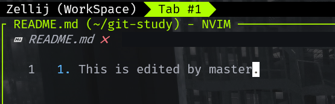
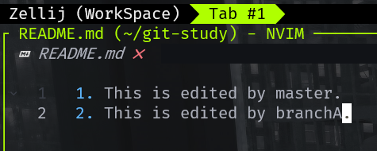
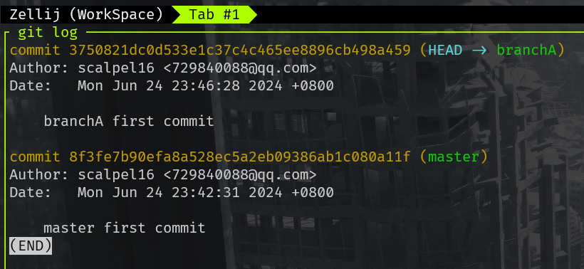
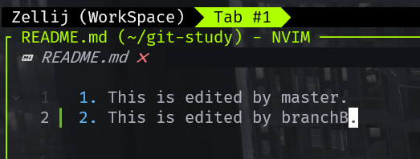
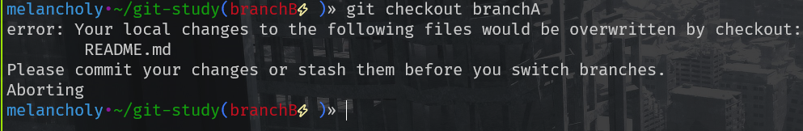
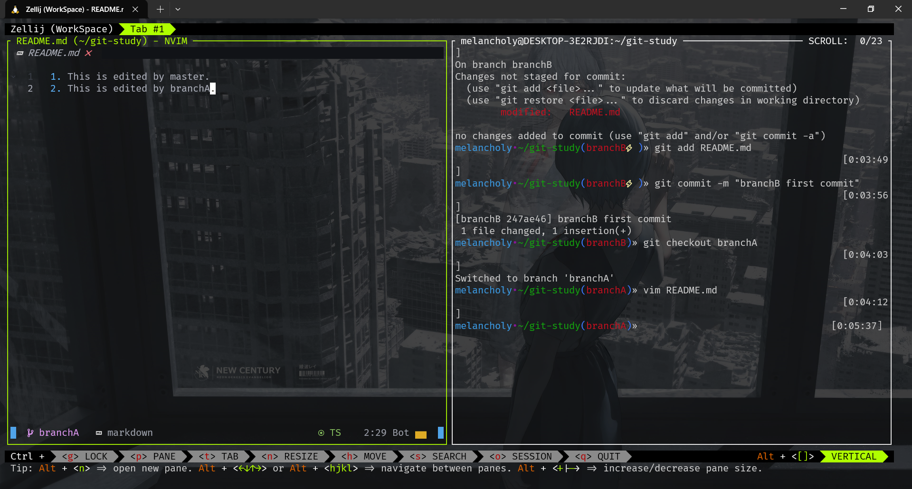

# git多分支并行问题

## 1 问题概述

今天在实习中遇到一个问题：
1. 在分支A中提交了工作，正在Review，尚未被合并进主分支
2. 在分支B的工作中，涉及修改分支A中修改的文件
于是我就有这样一个疑问：如果分支A在Review中发现问题，需要重新修改，再次提交相同的文件会不会包含分支B中的修改？

**实践出真知**，我们不妨来试一试。

我们初始化一个仓库，并且新建一个文件，并且编辑
```bash
git init

vim README.md

git add README.md

git commit -m "master first commit"

```

**`master`分支下编辑：**



接下来我们新建分支`branchA`，并且进行编辑然后commit。

**`branchA`分支下编辑：**



```bash
git checkout -b branchA

vim README.md # 编辑文件

git add README.md

git commit -m "branchA first commit"
```



接下来我们创建`branchB`并且进行编辑（**假设我们正在处理B分支的工作，但是分支A需要再次修改**）

> 注意这里创建B分支时需要切换回主分支，因为git的分支具有“子树”的结构。
>
> 值得一提的是：当你在branchB打开README,md时，你能看到的**只有master那一行**。

**`branchB`分支下编辑：**



之后我们尝试切换回`branchA`分支，发现出现错误提示



说明当前分支上的修改还没有提交或保存，这些修改会在切换分支时被覆盖。

对于这种情况有以下几种解决方案。

## 2 解决方案

### 2.1 提交`branchB`修改

```bash
# on branchB
git add README.md

git commmit -m "branchB first commmit"

# 此时切换分支不会有错误
git checkout branchA
```

可以观察到此时在`branchA`中兵没有来自`branchB`的修改



### 2.2 不提交`branchB`修改

```bash
# 如果你不想现在提交更改，可以使用 git stash 暂时保存这些更改
git stash

git checkout branchA

# 恢复更改（可选）
git stash apply
```

### 2.3 丢弃`branchB`更改

```bash
git checkout -- README.md

git checkout branchA
```

