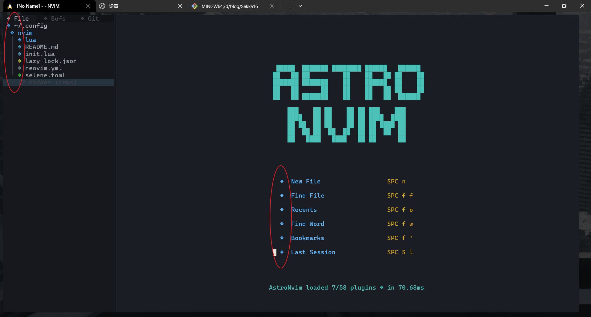
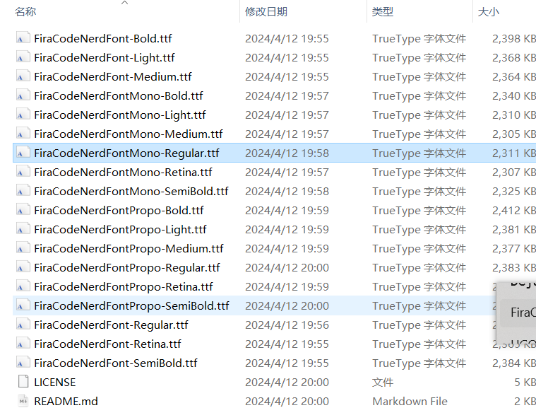
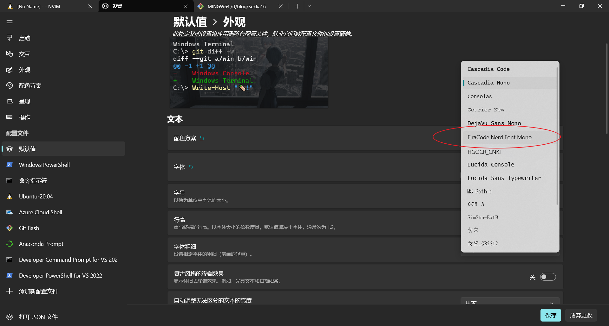
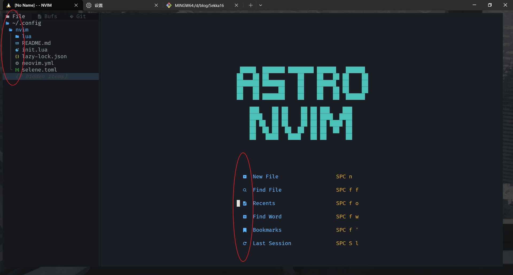

# vim图标乱码问题

环境：window 10

工具：windows terminal、nvim

配置`AstroNvim`，具体过程不再赘述，配置完成后发现有部分图标发生了乱码情况，如下图所示：

经查询发现是字体问题，解决方法是在[NerdFonts](https://www.nerdfonts.com/)下载新的字体，我这里下载的是FiraCode Nerd Font，下载好之后是一个压缩包，里面是一些后缀为`.ttf`的文件，参考`README.md`选择一个，我选择的是`Mono-Regular`。

安装之后在windows terminal中，设置-默认值-字体中设置新装的字体。

之后重新打开nvim，发现图标乱码都已经显示正常了。

